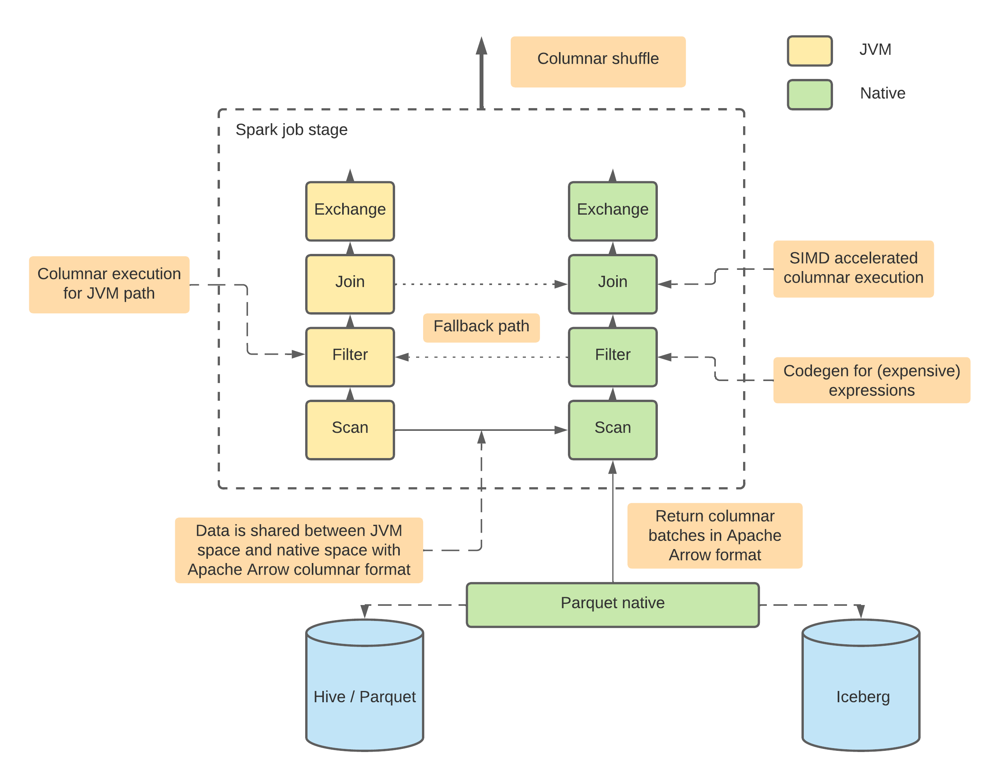

<!--
Licensed to the Apache Software Foundation (ASF) under one
or more contributor license agreements.  See the NOTICE file
distributed with this work for additional information
regarding copyright ownership.  The ASF licenses this file
to you under the Apache License, Version 2.0 (the
"License"); you may not use this file except in compliance
with the License.  You may obtain a copy of the License at

  http://www.apache.org/licenses/LICENSE-2.0

Unless required by applicable law or agreed to in writing,
software distributed under the License is distributed on an
"AS IS" BASIS, WITHOUT WARRANTIES OR CONDITIONS OF ANY
KIND, either express or implied.  See the License for the
specific language governing permissions and limitations
under the License.
-->

# Apache Arrow DataFusion Comet

Comet is an Apache Spark plugin that uses [Apache Arrow DataFusion](https://arrow.apache.org/datafusion/)
as native runtime to achieve improvement in terms of query efficiency and query runtime.

Comet runs Spark SQL queries using the native DataFusion runtime, which is
typically faster and more resource efficient than JVM based runtimes.

<a href="doc/comet-overview.png"></a>

Comet aims to support:
- a native Parquet implementation, including both reader and writer
- full implementation of Spark operators, including
  Filter/Project/Aggregation/Join/Exchange etc.
- full implementation of Spark built-in expressions
- a UDF framework for users to migrate their existing UDF to native

## Architecture

The following diagram illustrates the architecture of Comet:

<a href="doc/comet-overview.png"></a>

## Current Status

The project is currently integrated into Apache Spark 3.2, 3.3, and 3.4.

## Feature Parity with Apache Spark

The project strives to keep feature parity with Apache Spark, that is,
users should expect the same behavior (w.r.t features, configurations,
query results, etc) with Comet turned on or turned off in their Spark
jobs. In addition, Comet extension should automatically detect unsupported
features and fallback to Spark engine.

To achieve this, besides unit tests within Comet itself, we also re-use
Spark SQL tests and make sure they all pass with Comet extension
enabled.

## Supported Platforms

Linux, Apple OSX (Intel and M1)

## Requirements

- Apache Spark 3.2, 3.3, or 3.4
- JDK 8, 11 and 17 (JDK 11 recommended because Spark 3.2 doesn't support 17)
- GLIBC 2.17 (Centos 7) and up

## Getting started

Make sure the requirements above are met and software installed on your machine

### Clone repo
```commandline
git clone https://github.com/apache/arrow-datafusion-comet.git
```

### Specify the Spark version and build the Comet
Spark 3.4 used for the example.
```
cd arrow-datafusion-comet
make release PROFILES="-Pspark-3.4"
```

### Run Spark with Comet enabled
Make sure `SPARK_HOME` points to the same Spark version as Comet has built for.

```
$SPARK_HOME/bin/spark-shell --jars spark/target/comet-spark-spark3.4_2.12-0.1.0-SNAPSHOT.jar \
--conf spark.sql.extensions=org.apache.comet.CometSparkSessionExtensions \
--conf spark.comet.enabled=true \
--conf spark.comet.exec.enabled=true \
--conf spark.comet.exec.all.enabled=true
```

### Verify Comet enabled for Spark SQL query  

Create a test Parquet source
```scala
scala> (0 until 10).toDF("a").write.mode("overwrite").parquet("/tmp/test")
```

Query the data from the test source and check: 
- INFO message shows the native Comet library has been initialized.
- The query plan reflects Comet operators being used for this query instead of Spark ones
```scala
scala> spark.read.parquet("/tmp/test").createOrReplaceTempView("t1")
scala> spark.sql("select * from t1 where a > 5").explain
INFO src/lib.rs: Comet native library initialized
== Physical Plan ==
        *(1) ColumnarToRow
        +- CometFilter [a#14], (isnotnull(a#14) AND (a#14 > 5))
          +- CometScan parquet [a#14] Batched: true, DataFilters: [isnotnull(a#14), (a#14 > 5)], 
             Format: CometParquet, Location: InMemoryFileIndex(1 paths)[file:/tmp/test], PartitionFilters: [], 
             PushedFilters: [IsNotNull(a), GreaterThan(a,5)], ReadSchema: struct<a:int>
```

### Enable Comet shuffle

Comet shuffle feature is disabled by default. To enable it, please add related configs:

```
--conf spark.shuffle.manager=org.apache.spark.sql.comet.execution.shuffle.CometShuffleManager
--conf spark.comet.exec.shuffle.enabled=true
```

Above configs enable Comet native shuffle which only supports hash partition and single partition.
Comet native shuffle doesn't support complex types yet.

Comet doesn't have official release yet so currently the only way to test it is to build jar and include it in your Spark application. Depending on your deployment mode you may also need to set the driver & executor class path(s) to explicitly contain Comet otherwise Spark may use a different class-loader for the Comet components than its internal components which will then fail at runtime. For example:

```
--driver-class-path spark/target/comet-spark-spark3.4_2.12-0.1.0-SNAPSHOT.jar
```

Some cluster managers may require additional configuration, see https://spark.apache.org/docs/latest/cluster-overview.html

To enable columnar shuffle which supports all partitioning and basic complex types, one more config is required:
```
--conf spark.comet.columnar.shuffle.enabled=true
```
