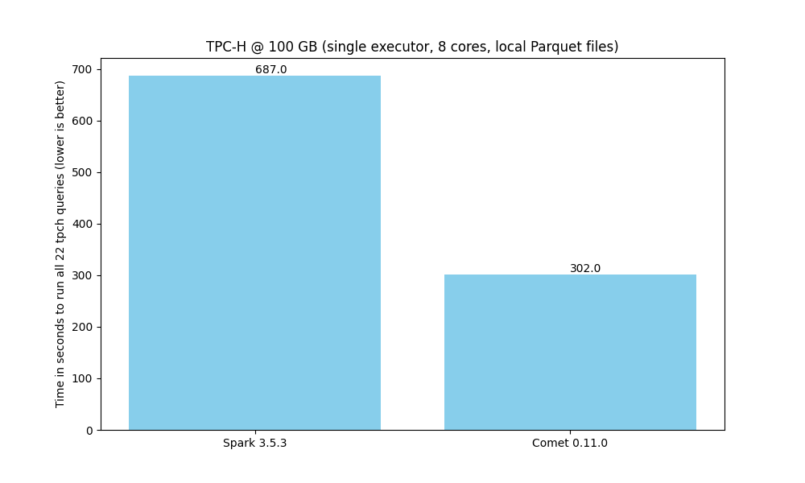
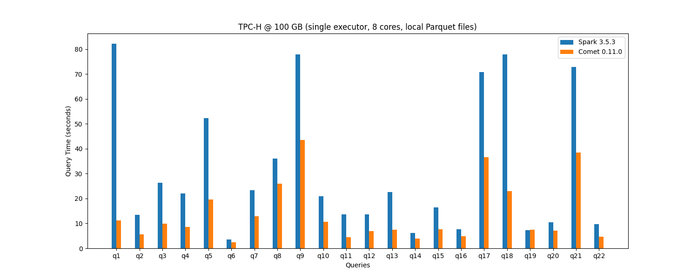
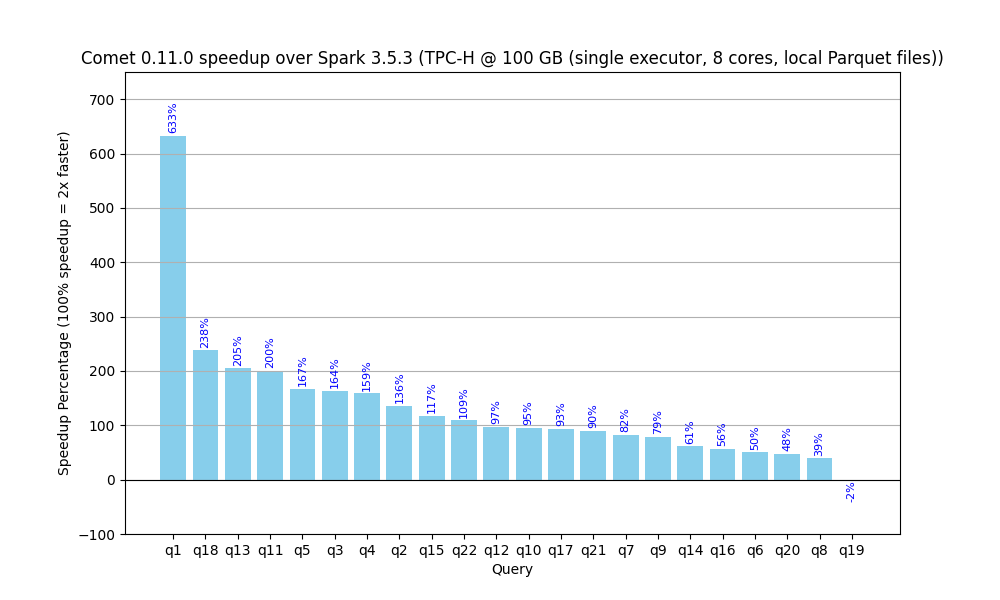
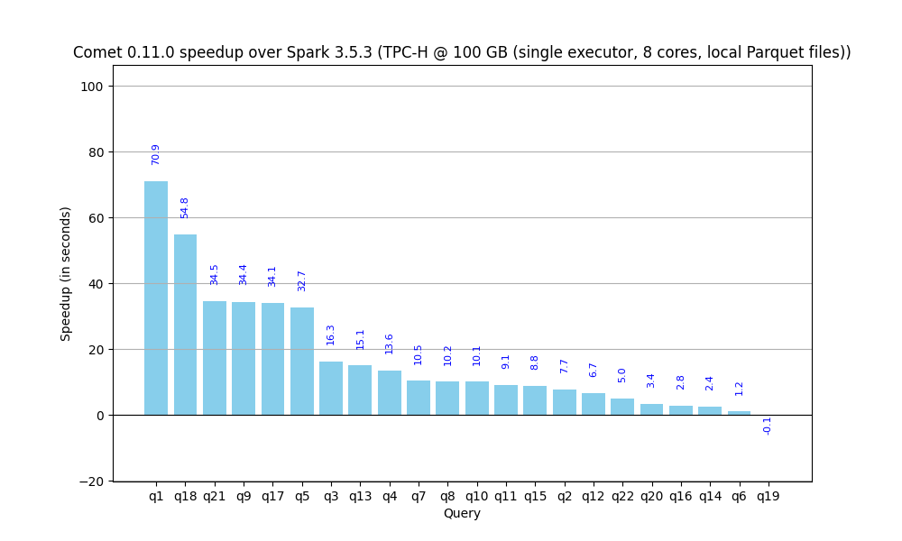

<!--
Licensed to the Apache Software Foundation (ASF) under one
or more contributor license agreements.  See the NOTICE file
distributed with this work for additional information
regarding copyright ownership.  The ASF licenses this file
to you under the Apache License, Version 2.0 (the
"License"); you may not use this file except in compliance
with the License.  You may obtain a copy of the License at

  http://www.apache.org/licenses/LICENSE-2.0

Unless required by applicable law or agreed to in writing,
software distributed under the License is distributed on an
"AS IS" BASIS, WITHOUT WARRANTIES OR CONDITIONS OF ANY
KIND, either express or implied.  See the License for the
specific language governing permissions and limitations
under the License.
-->

# Apache DataFusion Comet

[![Apache licensed][license-badge]][license-url]
[![Discord chat][discord-badge]][discord-url]
[![Pending PRs][pending-pr-badge]][pending-pr-url]
[![Maven Central][maven-badge]][maven-url]

[license-badge]: https://img.shields.io/badge/license-Apache%20v2-blue.svg
[license-url]: https://github.com/apache/datafusion-comet/blob/main/LICENSE.txt
[discord-badge]: https://img.shields.io/discord/885562378132000778.svg?logo=discord&style=flat-square
[discord-url]: https://discord.gg/3EAr4ZX6JK
[pending-pr-badge]: https://img.shields.io/github/issues-search/apache/datafusion-comet?query=is%3Apr+is%3Aopen+draft%3Afalse+review%3Arequired+status%3Asuccess&label=Pending%20PRs&logo=github
[pending-pr-url]: https://github.com/apache/datafusion-comet/pulls?q=is%3Apr+is%3Aopen+draft%3Afalse+review%3Arequired+status%3Asuccess+sort%3Aupdated-desc
[maven-badge]: https://img.shields.io/maven-central/v/org.apache.datafusion/comet-spark-spark4.0_2.13
[maven-url]: https://search.maven.org/search?q=g:org.apache.datafusion%20AND%20comet-spark


Apache DataFusion Comet is a high-performance accelerator for Apache Spark, built on top of the powerful
[Apache DataFusion] query engine. Comet is designed to significantly enhance the
performance of Apache Spark workloads while leveraging commodity hardware and seamlessly integrating with the
Spark ecosystem without requiring any code changes.

[Apache DataFusion]: https://datafusion.apache.org

## Supported Spark Versions

Comet supports Apache Spark 3.4 and 3.5, and provides experimental support for Spark 4.0. See the
[installation guide](https://datafusion.apache.org/comet/user-guide/installation.html) for the detailed
version, Java, and Scala compatibility matrix.

## What Comet Accelerates

Comet replaces Spark operators and expressions with native Rust implementations that run on Apache DataFusion.
It uses Apache Arrow for zero-copy data transfer between the JVM and native code.

- **Parquet scans** — native Parquet reader integrated with Spark's query planner
- **Apache Iceberg** — accelerated Parquet scans when reading Iceberg tables from Spark
  (see the [Iceberg guide](https://datafusion.apache.org/comet/user-guide/iceberg.html))
- **Shuffle** — native columnar shuffle with support for hash and range partitioning
- **Expressions** — hundreds of supported Spark expressions across math, string, datetime, array,
  map, JSON, hash, and predicate categories
- **Aggregations** — hash aggregate with support for `FILTER (WHERE ...)` clauses
- **Joins** — hash join, sort-merge join, and broadcast join
- **Window functions** — including `LEAD`/`LAG` with `IGNORE NULLS`
- **Metrics** — Comet metrics are exposed through Spark's external monitoring system

For the authoritative lists, see the [supported expressions](https://datafusion.apache.org/comet/user-guide/expressions.html)
and [supported operators](https://datafusion.apache.org/comet/user-guide/operators.html) pages.

## Benefits of Using Comet

### Run Spark Queries at DataFusion Speeds

Comet delivers a significant performance speedup for many queries, enabling faster data processing and shorter
time-to-insights.

The following chart shows the time it takes to run the 22 TPC-H queries against 100 GB of data in Parquet format
using a single executor with 8 cores. See the [Comet Benchmarking Guide](https://datafusion.apache.org/comet/contributor-guide/benchmarking.html)
for details of the environment used for these benchmarks.



Here is a breakdown showing relative performance of Spark and Comet for each TPC-H query.



The following charts show how much Comet currently accelerates each query from the benchmark.

#### Relative speedup



#### Absolute speedup



Results for our benchmark derived from TPC-DS are available in the
[benchmarking guide](https://datafusion.apache.org/comet/contributor-guide/benchmark-results/tpc-ds.html).

These benchmarks can be reproduced in any environment using the documentation in the
[Comet Benchmarking Guide](https://datafusion.apache.org/comet/contributor-guide/benchmarking.html). We encourage
you to run your own benchmarks.

### Use Commodity Hardware

Comet leverages commodity hardware, eliminating the need for costly hardware upgrades or
specialized hardware accelerators, such as GPUs or FPGAs. By maximizing the utilization of commodity hardware, Comet
ensures cost-effectiveness and scalability for your Spark deployments.

### Spark Compatibility

Comet aims for 100% compatibility with all supported versions of Apache Spark, allowing you to integrate Comet into
your existing Spark deployments and workflows seamlessly. With no code changes required, you can immediately harness
the benefits of Comet's acceleration capabilities without disrupting your Spark applications.

### Tight Integration with Apache DataFusion

Comet tightly integrates with the core Apache DataFusion project, leveraging its powerful execution engine. With
seamless interoperability between Comet and DataFusion, you can achieve optimal performance and efficiency in your
Spark workloads.

## Getting Started

Install Comet by adding the jar for your Spark and Scala version to the Spark classpath and enabling the plugin.
A typical configuration looks like:

```
--jars /path/to/comet-spark-spark3.5_2.12-<version>.jar \
--conf spark.plugins=org.apache.spark.CometPlugin \
--conf spark.shuffle.manager=org.apache.spark.sql.comet.execution.shuffle.CometShuffleManager \
--conf spark.comet.enabled=true \
--conf spark.comet.exec.enabled=true \
--conf spark.comet.exec.shuffle.enabled=true
```

For full installation instructions, published jar downloads, and configuration reference, see the
[installation guide](https://datafusion.apache.org/comet/user-guide/installation.html) and the
[configuration reference](https://datafusion.apache.org/comet/user-guide/configs.html).

Follow the [Apache DataFusion Comet Overview](https://datafusion.apache.org/comet/about/index.html#comet-overview)
for more detailed information.

## Community

Join the [DataFusion Slack and Discord channels](https://datafusion.apache.org/contributor-guide/communication.html)
to connect with other users, ask questions, and share your experiences with Comet.

## Contributing

We welcome contributions from the community to help improve and enhance Apache DataFusion Comet. Whether it's fixing
bugs, adding new features, writing documentation, or optimizing performance, your contributions are invaluable in
shaping the future of Comet. Check out our
[contributor guide](https://datafusion.apache.org/comet/contributor-guide/contributing.html) to get started.

## License

Apache DataFusion Comet is licensed under the Apache License 2.0. See the [LICENSE.txt](LICENSE.txt) file for details.
