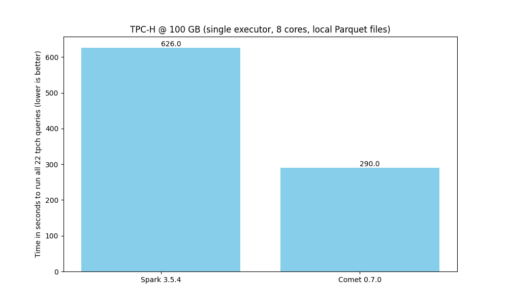
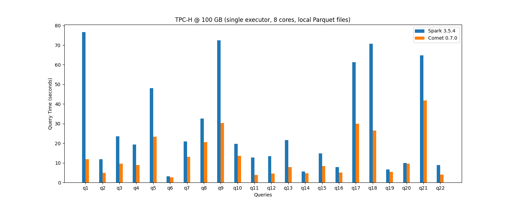
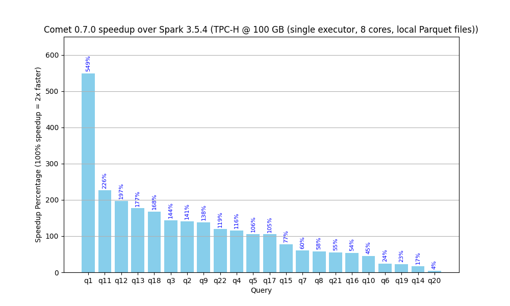
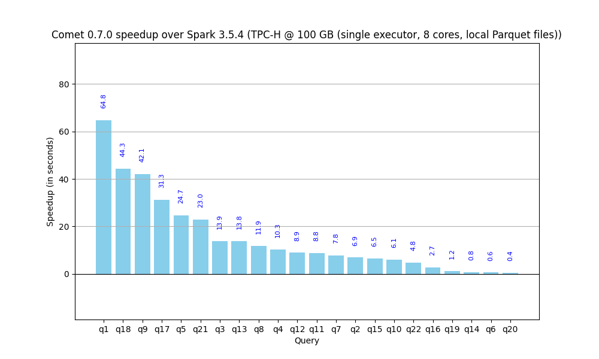

<!--
Licensed to the Apache Software Foundation (ASF) under one
or more contributor license agreements.  See the NOTICE file
distributed with this work for additional information
regarding copyright ownership.  The ASF licenses this file
to you under the Apache License, Version 2.0 (the
"License"); you may not use this file except in compliance
with the License.  You may obtain a copy of the License at

  http://www.apache.org/licenses/LICENSE-2.0

Unless required by applicable law or agreed to in writing,
software distributed under the License is distributed on an
"AS IS" BASIS, WITHOUT WARRANTIES OR CONDITIONS OF ANY
KIND, either express or implied.  See the License for the
specific language governing permissions and limitations
under the License.
-->

# Apache DataFusion Comet: Benchmarks Derived From TPC-H

The following benchmarks were performed on a Linux workstation with PCIe 5, AMD 7950X CPU (16 cores), 128 GB RAM, and
data stored locally in Parquet format on NVMe storage. Performance characteristics will vary in different environments
and we encourage you to run these benchmarks in your own environments.

The tracking issue for improving TPC-H performance is [#391](https://github.com/apache/datafusion-comet/issues/391).



Here is a breakdown showing relative performance of Spark and Comet for each query.



The following chart shows how much Comet currently accelerates each query from the benchmark in relative terms.



The following chart shows how much Comet currently accelerates each query from the benchmark in absolute terms.



The raw results of these benchmarks in JSON format is available here:

- [Spark](0.7.0/spark-tpch.json)
- [Comet](0.7.0/comet-tpch.json)

# Scripts

Here are the scripts that were used to generate these results.

## Apache Spark 

```shell
$SPARK_HOME/bin/spark-submit \
    --master $SPARK_MASTER \
    --conf spark.driver.memory=8G \
    --conf spark.executor.instances=1 \
    --conf spark.executor.cores=8 \
    --conf spark.executor.memory=16G \
    --conf spark.memory.offHeap.enabled=true \
    --conf spark.memory.offHeap.size=16g \
    --deploy-mode cluster \
    --conf spark.kubernetes.container.image.pullPolicy=Always \
    --conf spark.kubernetes.authenticate.driver.serviceAccountName=spark \
    --conf spark.kubernetes.driver.container.image=$SPARK_BENCHMARK_IMAGE \
    --conf spark.kubernetes.driver.volumes.persistentVolumeClaim.benchmark-results-pv.options.claimName=benchmark-results-pvc \
    --conf spark.kubernetes.driver.volumes.persistentVolumeClaim.benchmark-results-pv.mount.path=/mnt/benchmark-results \
    --conf spark.kubernetes.driver.volumes.persistentVolumeClaim.benchmark-results-pv.mount.readOnly=false \
    --conf spark.kubernetes.driver.volumes.hostPath.data.mount.path=/mnt/bigdata \
    --conf spark.kubernetes.driver.volumes.hostPath.data.options.path=/mnt/bigdata \
    --conf spark.kubernetes.driver.volumes.hostPath.data.options.readOnly=false \
    --conf spark.kubernetes.executor.container.image=$SPARK_BENCHMARK_IMAGE \
    --conf spark.kubernetes.executor.volumes.hostPath.data.mount.path=/mnt/bigdata \
    --conf spark.kubernetes.executor.volumes.hostPath.data.options.path=/mnt/bigdata \
    --conf spark.eventLog.enabled=false \
    local:///tpcbench.py \
    --name spark \
    --benchmark tpch \
    --data /mnt/bigdata/tpch/sf100/ \
    --queries /tpch \
    --output /mnt/benchmark-results \
    --iterations 1
```

## Apache Spark + Comet

```shell
export COMET_JAR=local:///opt/spark/jars/comet-spark-spark3.5_2.12-0.7.0.jar
$SPARK_HOME/bin/spark-submit \
    --master $SPARK_MASTER \
    --conf spark.driver.memory=8G \
    --conf spark.executor.instances=1 \
    --conf spark.executor.cores=8 \
    --conf spark.executor.memory=16G \
    --conf spark.memory.offHeap.enabled=true \
    --conf spark.memory.offHeap.size=16g \
    --conf spark.shuffle.manager=org.apache.spark.sql.comet.execution.shuffle.CometShuffleManager \
    --conf spark.comet.exec.enabled=true \
    --conf spark.comet.scan.impl=native_comet \
    --conf spark.comet.cast.allowIncompatible=true \
    --conf spark.comet.exec.replaceSortMergeJoin=true \
    --conf spark.comet.exec.shuffle.enabled=true \
    --conf spark.comet.exec.shuffle.mode=auto \
    --conf spark.comet.exec.shuffle.fallbackToColumnar=true \
    --conf spark.comet.exec.shuffle.compression.codec=lz4 \
    --conf spark.comet.exec.shuffle.compression.level=1 \
    --conf spark.comet.explain.native.enabled=false \
    --deploy-mode cluster \
    --jars $COMET_JAR \
    --conf spark.driver.extraClassPath=$COMET_JAR \
    --conf spark.executor.extraClassPath=$COMET_JAR \
    --conf spark.driver.extraJavaOptions="-Dlog4j.configuration=file:/opt/spark/conf/log4j.properties" \
    --conf spark.executor.extraJavaOptions="-Dlog4j.configuration=file:/opt/spark/conf/log4j.properties" \
    --conf spark.plugins=org.apache.spark.CometPlugin \
    --conf spark.kubernetes.container.image.pullPolicy=Always \
    --conf spark.kubernetes.authenticate.driver.serviceAccountName=spark \
    --conf spark.kubernetes.driver.container.image=$COMET_BENCHMARK_IMAGE \
    --conf spark.kubernetes.driver.volumes.persistentVolumeClaim.benchmark-results-pv.options.claimName=benchmark-results-pvc \
    --conf spark.kubernetes.driver.volumes.persistentVolumeClaim.benchmark-results-pv.mount.path=/mnt/benchmark-results \
    --conf spark.kubernetes.driver.volumes.persistentVolumeClaim.benchmark-results-pv.mount.readOnly=false \
    --conf spark.kubernetes.driver.volumes.hostPath.data.mount.path=/mnt/bigdata \
    --conf spark.kubernetes.driver.volumes.hostPath.data.options.path=/mnt/bigdata \
    --conf spark.kubernetes.driver.volumes.hostPath.data.options.readOnly=false \
    --conf spark.kubernetes.executor.container.image=$COMET_BENCHMARK_IMAGE \
    --conf spark.kubernetes.executor.volumes.hostPath.data.mount.path=/mnt/bigdata \
    --conf spark.kubernetes.executor.volumes.hostPath.data.options.path=/mnt/bigdata \
    --conf spark.eventLog.enabled=false \
    local:///tpcbench.py \
    --name comet \
    --benchmark tpch \
    --data /mnt/bigdata/tpch/sf100/ \
    --queries /tpch \
    --output /mnt/benchmark-results \
    --iterations 1
```