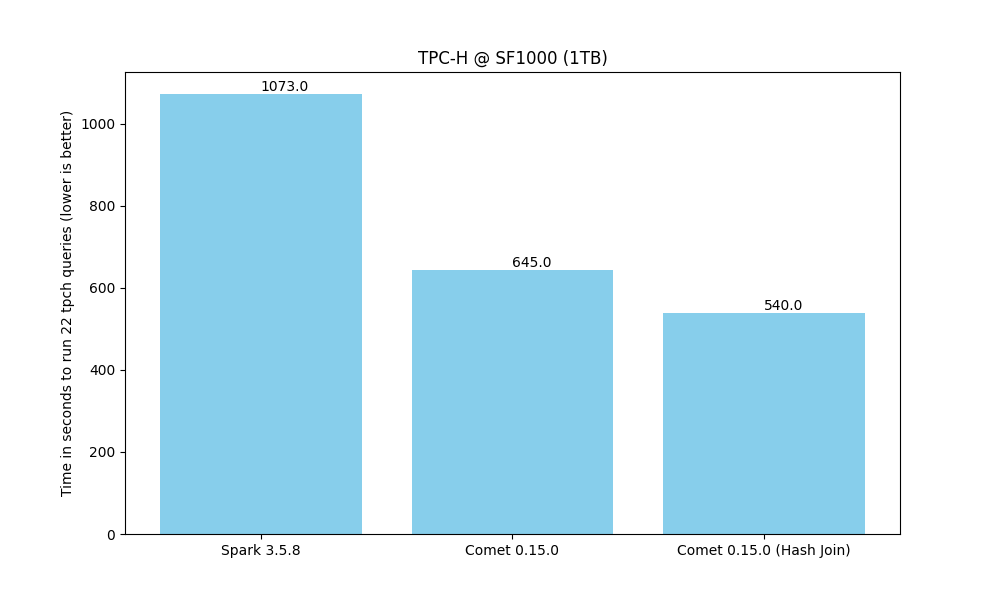
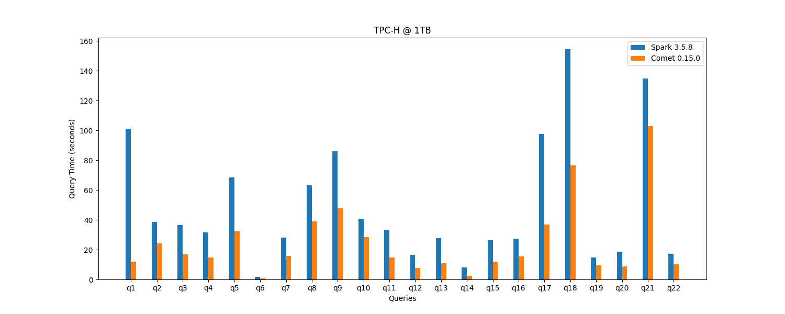
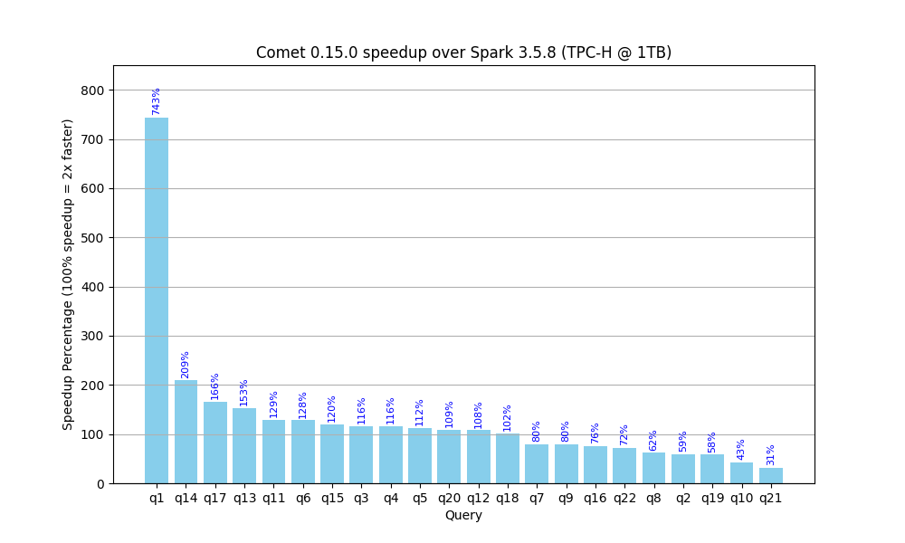
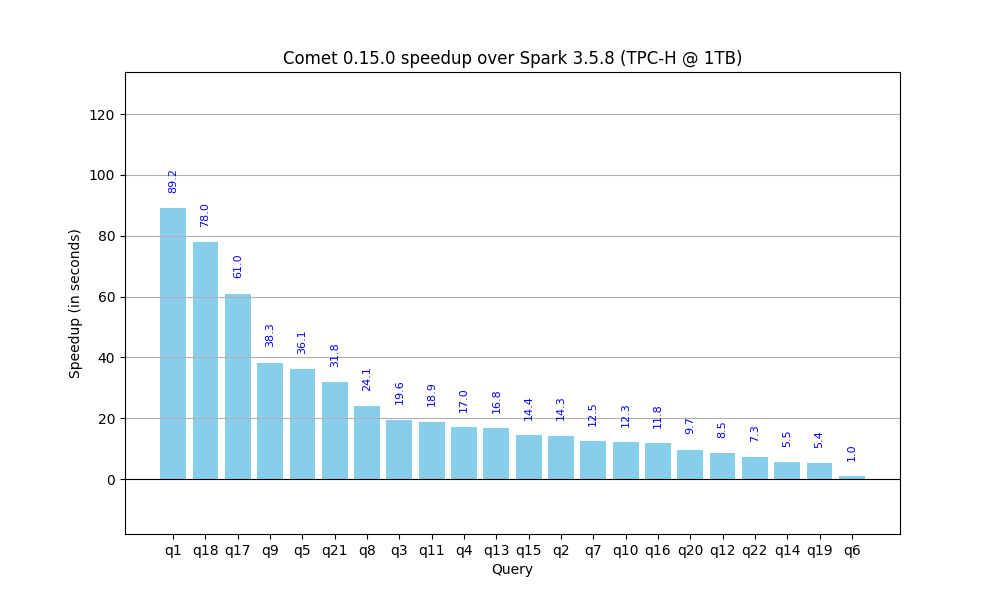

<!--
Licensed to the Apache Software Foundation (ASF) under one
or more contributor license agreements.  See the NOTICE file
distributed with this work for additional information
regarding copyright ownership.  The ASF licenses this file
to you under the Apache License, Version 2.0 (the
"License"); you may not use this file except in compliance
with the License.  You may obtain a copy of the License at

  http://www.apache.org/licenses/LICENSE-2.0

Unless required by applicable law or agreed to in writing,
software distributed under the License is distributed on an
"AS IS" BASIS, WITHOUT WARRANTIES OR CONDITIONS OF ANY
KIND, either express or implied.  See the License for the
specific language governing permissions and limitations
under the License.
-->

# Apache DataFusion Comet: Benchmarks Derived From TPC-H

The following benchmarks were performed on an EKS cluster (`r61.2xlarge` instances with EBS storage) with data stored in S3.

## Configuration

Common:

```properties
spark.executor.instances=32
spark.executor.cores=16
spark.memory.fraction=0.6
spark.memory.storageFraction=0.2
```

Spark:

```properties
spark.executor.memory=64G
spark.executor.memoryOverhead=10G
```

Comet:

```properties
spark.executor.memory=32G
spark.executor.memoryOverhead=10G
spark.memory.offHeap.enabled=true
spark.memory.offHeap.size=32G
spark.comet.memoryPool.fraction=0.7
```

Comet (Tuned):

```properties
spark.executor.memory=32G
spark.executor.memoryOverhead=10G
spark.memory.offHeap.enabled=true
spark.memory.offHeap.size=32G
spark.comet.exec.replaceSortMergeJoin=true
spark.comet.memoryPool.fraction=0.8
```

## Benchmark Results



## Comet (with Hash Join enabled)

Here is a breakdown showing relative performance of Spark and Comet for each query.



The following chart shows how much Comet currently accelerates each query from the benchmark in relative terms.



The following chart shows how much Comet currently accelerates each query from the benchmark in absolute terms.



