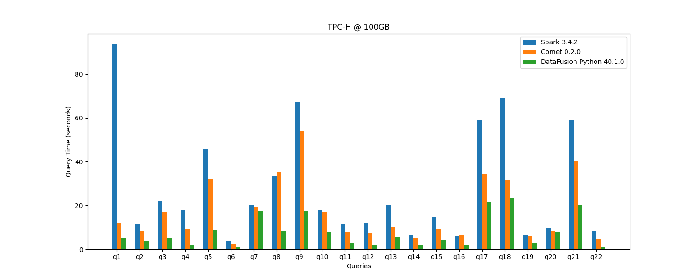

<!--
Licensed to the Apache Software Foundation (ASF) under one
or more contributor license agreements.  See the NOTICE file
distributed with this work for additional information
regarding copyright ownership.  The ASF licenses this file
to you under the Apache License, Version 2.0 (the
"License"); you may not use this file except in compliance
with the License.  You may obtain a copy of the License at

  http://www.apache.org/licenses/LICENSE-2.0

Unless required by applicable law or agreed to in writing,
software distributed under the License is distributed on an
"AS IS" BASIS, WITHOUT WARRANTIES OR CONDITIONS OF ANY
KIND, either express or implied.  See the License for the
specific language governing permissions and limitations
under the License.
-->

# Apache DataFusion Comet: Benchmarks Derived From TPC-H

The following benchmarks were performed on a Linux workstation with PCIe 5, AMD 7950X CPU (16 cores), 128 GB RAM, and
data stored locally on NVMe storage. Performance characteristics will vary in different environments and we encourage
you to run these benchmarks in your own environments.

Comet can not yet run all TPC-H queries natively. The tracking issue is [#391](https://github.com/apache/datafusion-comet/issues/391).

Comet currently provides a 62% speedup for TPC-H @ SF=100GB.

Here is a breakdown showing relative performance of Spark, Comet, and DataFusion for each query.

The following chart shows how much Comet currently accelerates each query from the benchmark.

The raw results of these benchmarks in JSON format is available here:

- [Spark](./2024-08-23/spark-tpch.json)
- [Comet](./2024-08-23/comet-tpch.json)
- [DataFusion](./2024-08-23/datafusion-python-tpch.json)