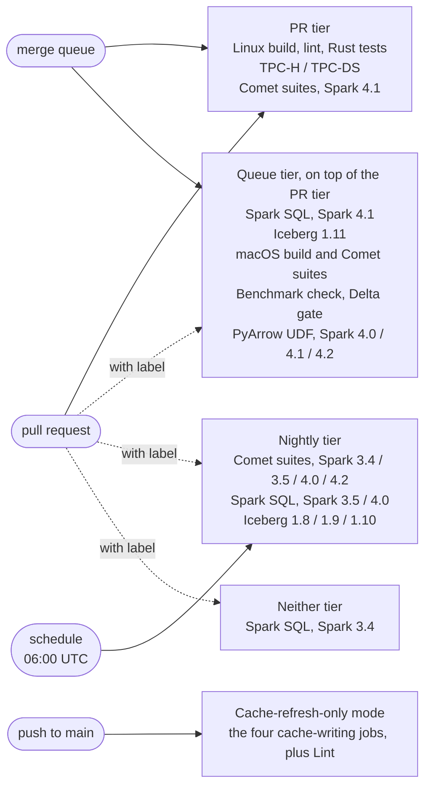

<!--
Licensed to the Apache Software Foundation (ASF) under one
or more contributor license agreements.  See the NOTICE file
distributed with this work for additional information
regarding copyright ownership.  The ASF licenses this file
to you under the Apache License, Version 2.0 (the
"License"); you may not use this file except in compliance
with the License.  You may obtain a copy of the License at

  http://www.apache.org/licenses/LICENSE-2.0

Unless required by applicable law or agreed to in writing,
software distributed under the License is distributed on an
"AS IS" BASIS, WITHOUT WARRANTIES OR CONDITIONS OF ANY
KIND, either express or implied.  See the License for the
specific language governing permissions and limitations
under the License.
-->

# Continuous Integration

Comet runs CI through GitHub Actions, and merges to `main` go through GitHub's merge queue. This
page is the contributor's view of both: what runs on a pull request, what runs later in the queue,
how to opt a pull request into a suite the PR tier skips, and what to do when a run fails. The
mechanics behind the configuration are documented in
[.github/workflows/README.md](https://github.com/apache/datafusion-comet/blob/main/.github/workflows/README.md).

## Three tiers

A single umbrella workflow, `.github/workflows/ci.yml`, orchestrates everything. It runs cheap
preflight checks first (license headers, Markdown formatting, workflow linting, the CI config
checks), computes which heavy jobs the changed files are relevant to, and fans out to those jobs.
Which jobs run also depends on the event:



Suite by suite:

| Suite                                             | Pull request | Merge queue | Nightly |
| ------------------------------------------------- | ------------ | ----------- | ------- |
| Linux build, lint, Rust tests, TPC-H/TPC-DS       | yes          | yes         | no      |
| Comet test suites, Spark 4.1                      | yes          | yes         | no      |
| Spark SQL tests, Spark 4.1, catalyst and sql_core | with label   | yes         | no      |
| Spark SQL tests, Spark 4.1, sql_hive              | with label   | yes         | no      |
| Iceberg Spark SQL tests, Iceberg 1.11             | with label   | yes         | no      |
| macOS build and Comet test suites                 | with label   | yes         | no      |
| Benchmark compile and lint check                  | with label   | yes         | no      |
| Delta contrib build gate                          | with label   | yes         | no      |
| PyArrow UDF tests, Spark 4.0 / 4.1 / 4.2          | with label   | yes         | no      |
| Comet test suites, Spark 3.4 / 3.5 / 4.0 / 4.2    | with label   | no          | yes     |
| Spark SQL tests, Spark 3.5 / 4.0                  | with label   | no          | yes     |
| Iceberg Spark SQL tests, Iceberg 1.8 / 1.9 / 1.10 | with label   | no          | yes     |
| Spark SQL tests, Spark 3.4                        | with label   | no          | no      |

The **PR tier** is the fast feedback loop while a change is being iterated on. The **queue
tier** is the authoritative gate: everything the PR tier runs plus the suites that must pass before
a change lands, evaluated against the merge result rather than the pull request head. The queue
runs one Spark version and one Iceberg version, the ones the default build profile targets. The
**nightly tier** runs the other Spark and Iceberg versions once a day against `main` as it stands;
see [Nightly runs](#nightly-runs) below. Nothing in the queue tier runs again
on push to `main`, because the queue already tested the exact tree that landed. The one exception
is the Linux build, which also runs on push so that the dependency caches on `main` stay fresh: a
pull request can only restore caches saved on its own branch or on `main`, and the queue's
temporary branch takes its caches with it when it is deleted.

That push run is for the caches and nothing else, so it runs in **cache-refresh-only** mode: only
the four jobs that own a cache entry (the native CI build, the Rust tests, and the two TPC-H/TPC-DS
jobs, the last two stopping before their query passes), plus the short `Lint` job the native jobs
depend on. The lints and the Comet test matrix are skipped, which is the difference between 587
runner-minutes a push and about 73. If you add a job to `pr_build_linux.yml`, give it
`if: ${{ !inputs.cache-refresh-only }}` unless it writes a cache that `main` needs;
`dev/ci/check-ci-config.py` fails the build if you forget.

Spark 3.4 is the one suite in neither tier. [Spark 3.4 support is deprecated](../user-guide/latest/compatibility/spark-versions.md#spark-34),
so its Spark SQL suite no longer gates a merge. It remains available on demand: apply the
`run-spark-3.4-tests` label to run it against a pull request, or trigger `ci.yml` from the Actions
page with **Run workflow**, which runs every suite regardless of tier. A contributor touching Spark
3.4 code can still get a verdict before merging, but applying the label is only half of that: the
run it starts is advisory. Label the pull request and then push, and Spark 3.4 joins the required
verdict like any other suite. See
[Opting a pull request into a suite the PR tier skips](#opting-a-pull-request-into-a-suite-the-pr-tier-skips)
for the mechanics.

Every job's result feeds one flat job named `Required Checks`, and that is the only status check
`main` requires. A job that is skipped because the change did not touch its inputs counts as a
pass. A job that fails or is cancelled turns `Required Checks` red.

Which tier a job belongs to is the `POLICY` table in `dev/ci/compute-changes.py`. Each job's path
filters are the `FILTERS` table in the same file, and `dev/ci/check-ci-config.py` holds the test
cases that pin both down.

## Opting a pull request into a suite the PR tier skips

Each suite outside the PR tier has a label that runs it on a pull request:

| Label                      | Runs                                                  |
| -------------------------- | ----------------------------------------------------- |
| `run-macos-tests`          | macOS build and Comet test suites                     |
| `run-all-spark-profiles`   | Comet test suites against Spark 3.4 / 3.5 / 4.0 / 4.2 |
| `run-benchmark-check`      | Benchmark compile and lint check                      |
| `run-delta-build-gate`     | Delta contrib build gate                              |
| `run-pyarrow-udf-tests`    | PyArrow UDF tests against Spark 4.0/4.1/4.2           |
| `run-spark-4.1-tests`      | Spark SQL tests against Spark 4.1, every module       |
| `run-spark-4.1-hive-tests` | Spark SQL tests against Spark 4.1, sql_hive only      |
| `run-spark-3.4-tests`      | Spark SQL tests against Spark 3.4                     |
| `run-spark-3.5-tests`      | Spark SQL tests against Spark 3.5                     |
| `run-spark-4.0-tests`      | Spark SQL tests against Spark 4.0                     |
| `run-iceberg-tests`        | Iceberg Spark SQL tests against every Iceberg version |

For a queue-tier suite the label only brings the run forward; the queue would have run it anyway
before the change landed. For a nightly-tier suite the label is what gets a verdict _before_ the
change lands: without it, the first run is the nightly after the merge. For Spark 3.4 the label is
the only way the suite runs at all.

Apply a label from the pull request sidebar, or from the command line:

```sh
gh pr edit <number> --add-label run-spark-3.5-tests
```

Applying a label starts a new run immediately at the pull request's current commit. That run
belongs to the separate `Comet CI (label run)` workflow and executes only the suite the label
gates; the PR tier already ran at that commit and is not repeated. Its aggregate verdict is
published as `Label run / Required Checks (label run)` rather than `Required Checks`, so it can be
read alongside the commit run without replacing it.

For a queue-tier suite, that separate name costs nothing: the merge queue runs the suite again
before the change lands, so a failure a label run surfaced still blocks the merge later. A
nightly-tier suite and Spark 3.4 have no queue run behind them. A red `Required Checks (label run)`
leaves an earlier green `Required Checks` in place and the pull request mergeable, so treat a label
run as feedback to read, not as a gate. For one of those suites to count toward the required
verdict the label has to already be on the pull request when a commit is pushed, which is what the
next push gives you, since the label stays applied. A nightly-tier regression that does slip
through is caught by the next nightly run and filed as an issue; a Spark 3.4 one is not.

The label stays on the pull request, so every later push runs the suite as part of the normal PR
run. Remove the label once it has served its purpose. To re-run the suite at the same commit,
re-run the failed jobs from the Actions page, or remove and re-apply the label.

Use a label when a change is likely to behave differently on a version or platform the PR tier
does not cover. Some examples:

- a change to the serde, the planner, or a native operator, where the Comet test suites pass but
  Spark's own SQL suite is the thing that would catch a behavior difference; `run-spark-4.1-tests`
  runs it against the default profile
- code under `spark/src/main/spark-3.4/`, `spark-3.5/`, `spark-4.0/` or the shared `spark-3.x/`
  directory, or any change to `CometExprShim` and friends; `run-all-spark-profiles` runs the Comet
  test suites against every Spark version rather than 4.1 alone (the Lint Java matrix already
  compiles the 3.4/3.5/4.0 profiles on every pull request, so this is for runtime differences)
- a change to a Spark SQL diff under `dev/diffs/`
- anything that touches Hive table support, `InsertIntoHiveTable`, or the `sql/hive` parts of
  the 4.1 diff
- anything touching Iceberg reflection, the Iceberg scan or write path, or the Iceberg diffs
- native code with platform-specific behavior, or a dependency bump that changes what is
  compiled on macOS
- a change to the benchmark sources under `spark/src/test/scala/org/apache/spark/sql/benchmark`
  or to `native/*/benches`

Reach for `run-spark-3.4-tests` deliberately, since nothing else will run it: a change to
`spark/src/main/spark-3.4/`, to `dev/diffs/3.4.3.diff`, or to shared code whose Spark 3.4 behavior
you are unsure of. Without the label, a Spark 3.4 regression will not be caught before the change
lands.

Labels that gate nothing, such as `dependencies` or the type labels, also start a run. That run
executes nothing and finishes in a minute. It is a consequence of GitHub firing the `labeled`
event for every label; see the workflows README for why it is handled this way.

## Merging through the queue

Once a pull request is approved, a committer queues it with **Merge when ready** in the GitHub
UI, or from the command line:

```sh
gh pr merge <number> --squash --auto
```

The pull request's own checks do not have to be finished, though it is polite not to queue a pull
request whose PR tier is red.

GitHub then builds a temporary branch named `gh-readonly-queue/main/...` containing the pull
request's commits squashed on top of the current `main`, batched with up to four other queued pull
requests, and runs `ci.yml` against it with a `merge_group` event. When `Required Checks` on that
branch is green, every pull request in the batch merges. If it is red, GitHub removes the pull
request whose entry failed, rebuilds the remaining entries without it, and records the removal on
the pull request's timeline.

The queue tests the merge result rather than the pull request head. That is the point of it: a
semantic conflict between two pull requests that each pass in isolation is caught before either
lands. It also means a pull request can be evicted for a failure it did not cause on its own,
because `main` moved or because another entry in the batch broke the combined tree.

## When a queue run fails

A queue failure removes the pull request from the queue but does not otherwise change it. Work
through these in order:

1. **Find the run.** On the Actions page, filter by the `merge_group` event, or:

   ```sh
   gh run list --event merge_group --limit 10
   gh run view <run-id> --log-failed
   ```

   The pull request's timeline links to the run as well.

2. **Decide whether it is infrastructure.** A job that dies in under a minute on an artifact
   download, a Maven download, or a runner setup step is not a test failure. Re-run the failed
   jobs and, if it passes, re-queue. Comet already retries the common cases, so if the same step
   fails repeatedly, open an issue with the `area:ci` label.

3. **Reproduce it on the pull request.** Merge `main` into the branch so the pull request head
   matches what the queue tested, then apply the label for the suite that failed. If the labeled
   run passes, the failure came from the batch, not from this change, and re-queuing is the right
   next step. If it fails, fix it on the branch like any other CI failure.

4. **Check for flakiness.** A test that is flaky in the queue tier blocks everyone's merges, not
   just one pull request. If a queue failure looks like a flake, do not just re-queue: file or
   update an issue naming the test, so it can be fixed or excluded.

A pull request evicted from the queue has to be queued again by hand. Merge when ready is not
re-armed automatically.

## Nightly runs

`ci.yml` also runs on a schedule, at 06:00 UTC every day, against what landed on `main` since the
last successful scheduled run. That run executes only the nightly tier: the Comet test suites against the Spark
profiles other than 4.1, the Spark SQL suites for Spark 3.5 and 4.0, and the Iceberg suites for
1.8, 1.9 and 1.10, each only when the day's changes touched files it covers. The queue already ran
everything else against the same tree, so nothing in the queue tier is repeated. A day with no
merges, or with only documentation changes, runs nothing.

If the previous run cannot be found — the first nightly, an unreachable Actions API, or a base that
is no longer on `main` — the run has nothing to diff against and runs the whole nightly tier
instead of guessing at a range.

A red nightly has no pull request to show up on, so the run opens an issue labelled
`ci-nightly-failure` that links the run and lists the jobs that failed. If one of those issues is
already open, the run comments on it instead, so a failure that persists across several nights
stays in one place. When you pick up a nightly failure:

1. **Find the commit.** The issue names the `main` commit the run tested, and the run's
   `Detect changes` log names the base it diffed against, which is the commit the previous green
   nightly tested. The regression is in that range.
2. **Reproduce it on a pull request.** Open the fix as a pull request and apply the label for
   the suite that failed, so the same suite runs against the fix before it lands.
3. **Close the issue** once the failure is understood, whether it was fixed, excluded, or found to
   be infrastructure. The next red nightly opens a new issue.

Dispatching `ci.yml` from the Actions page with **Run workflow** runs every tier, including the
nightly suites, if you need a result before the next scheduled run.

## Miri safety checks

`miri.yml` runs nightly and supports manual dispatch. It runs the shuffle crate's
`spark_unsafe::` tests and the expression crate's `hash_funcs::` tests in separate jobs,
so a failure in one does not cancel the other. These cover Comet's unsafe row decoding
and hash kernels. The job also fails if its filter selects no passing tests. A failed
scheduled run opens or updates the same `ci-nightly-failure` issue used by nightly CI.

Run either suite locally after installing nightly Rust with the Miri component:

```sh
cd native
cargo +nightly miri setup
MIRIFLAGS="-Zmiri-disable-isolation" cargo +nightly miri test --locked \
  -p datafusion-comet-shuffle --lib 'spark_unsafe::'
MIRIFLAGS="-Zmiri-disable-isolation" cargo +nightly miri test --locked \
  -p datafusion-comet-spark-expr --lib 'hash_funcs::'
```

Miri cannot execute the JVM, cloud clients, or compression libraries through FFI.
Running the whole workspace reaches those dependencies or dependency errors in
platform synchronization before completing the safety checks. Regular Rust CI still runs the
full tests. When adding unsafe code, add suitable tests to the Miri matrix as well;
these focused suites do not cover every unsafe operation in Comet.

## Checking that the scheduled runs are healthy

A scheduled run has no pull request to turn red, so check both whether it ran and whether it
reported a failure. Comet has three daily schedules plus a weekly one:

| Workflow               | Cron (UTC)   | Reports a failure?                    |
| ---------------------- | ------------ | ------------------------------------- |
| `publish_snapshot.yml` | `0 3 * * *`  | no                                    |
| `miri.yml`             | `0 4 * * *`  | yes                                   |
| `ci.yml` nightly tier  | `0 6 * * *`  | yes, a `ci-nightly-failure` issue     |
| `codeql.yml`           | `16 4 * * 1` | yes, to the repository's Security tab |

So the two without a reporting step have to be looked at deliberately. Check all of them at once:

```sh
for wf in ci.yml miri.yml publish_snapshot.yml; do
  gh api "repos/apache/datafusion-comet/actions/workflows/$wf/runs?event=schedule&per_page=5" \
    --jq ".workflow_runs[] | \"$wf\t\(.created_at[0:10])\t\(.conclusion)\t\(.html_url)\""
done
```

Read the output for two different things:

- **A missing row.** If the most recent run is not from the last day or two, the schedule itself
  stopped firing. GitHub drops scheduled runs under load and disables them entirely in a repository
  with no activity for 60 days, and it does not announce either. Confirm the workflow is still
  enabled with `gh api repos/apache/datafusion-comet/actions/workflows --jq '.workflows[] | "\(.state)\t\(.path)"'`,
  and re-enable it from the Actions page if it is `disabled_inactivity`.
- **A run of failures.** One red night is a flake or a real regression. `ci.yml` and `miri.yml`
  open or update a failure issue; `publish_snapshot.yml` does not. Investigate repeated failures
  even when a report already exists; treat the streak, not the newest run, as the thing to explain.

For the `ci.yml` nightly, green on its own does not mean the suites ran. Path filters and the diff
base are both allowed to select nothing — a documentation-only day legitimately runs no suite at
all — and a run that tested nothing reports exactly the same green `Required Checks` as a run that
tested everything. Confirm the suites actually ran:

```sh
run=$(gh api "repos/apache/datafusion-comet/actions/workflows/ci.yml/runs?event=schedule&per_page=1" \
        --jq '.workflow_runs[0].id')
gh run view "$run" --repo apache/datafusion-comet --json jobs \
  --jq '[.jobs[] | select(.name | test("^(Spark SQL|Iceberg Spark SQL) Tests"))]
        | group_by(.conclusion)[] | "\(length)\t\(.[0].conclusion)"'
```

A healthy run over a day of normal merges reports about 40 successes, with the handful of skips
being the suites that belong to the queue tier rather than the nightly one — Spark 3.4, Spark 4.1
and Iceberg 1.11. If everything is skipped, open the run's `Detect changes` job: it logs the
`Nightly base:` commit it diffed against and the list of changed files, which is enough to tell a
genuinely quiet day from a base that has drifted.

## Reproducing a suite failure locally

`dev/local-ci.sh` builds the same sandbox a runner builds and runs the Spark SQL or Iceberg
workflow:

```sh
dev/local-ci.sh spark                # everything the Spark job runs
dev/local-ci.sh spark sql_core-1     # just the shard that failed
dev/local-ci.sh iceberg              # everything the Iceberg job runs
dev/local-ci.sh iceberg shard-2
dev/local-ci.sh spark 3.5 sql_core-1 # a nightly-tier version, named explicitly
dev/local-ci.sh --print-config       # what it read from ci.yml and dev/ci
```

The version defaults to the one the merge queue gates on. That, the matrix rows and the shard count
are read from the workflow files and from `dev/ci/`, so a local shard runs what the CI shard of the
same name runs. It prepares first (native build, Comet install, patched Spark or Iceberg source
under `$COMET_LOCAL_CI_HOME`, default `/tmp/comet-local-ci`), then runs the tests, compiling only
the sbt projects the selected rows need.

`SKIP_PREPARE=1` runs the tests only. It skips the **Comet install** too, so do not use it after
changing Comet or the run tests the previously installed JAR and goes green regardless.

When more than one Spark row is selected they all run **at once**, each in its own copy of the
prepared tree, which is what CI does: seven matrix rows, seven runners, seven extracted trees.
Because each row owns a tree there is no shared sbt server, `target/` or metastore tmpdir, so the
per-row settings stay identical to CI's. On APFS and btrfs the copies are copy-on-write, so a 4 GB
tree costs kilobytes until the rows write their own reports.

Seven concurrent sbt processes would interleave unreadably, so each row logs to
`$COMET_LOCAL_CI_HOME/logs-spark-<version>/<row>.log`, named on the line that reports the row
starting. Each row then reports again when it finishes, with its elapsed time, and a failing row
prints the last 20 lines of its log. Follow a row live with `tail -f`. The trees persist so the
reports stay readable. A single row runs in the prepared tree with no copy. Iceberg targets still run
one after another.

Four caveats:

- The sandbox lives under `/tmp`, so a reboot or a tmp reaper means downloading and compiling again.
  Point `COMET_LOCAL_CI_HOME` somewhere durable to keep it.
- Running every row at once wants the memory and disk for it: seven sbt processes each forking a
  test JVM, and seven trees diverging from their copy-on-write base. Select fewer rows, or one, on a
  smaller machine.
- Preparing deletes `org/apache/parquet` from your local Maven repository as the workflows do, and
  additionally sweeps the **whole** repository for POMs with no sibling JAR. That is a shared cache,
  so other projects will re-download. `--print-config` touches nothing.
- CI is x86_64 Linux built with `-Ctarget-cpu=x86-64-v3`, so a pass elsewhere covers Scala, serde
  and planner behavior but not x86-specific native codegen.

The underlying steps are documented in [Spark SQL Tests](spark-sql-tests.md) and
[Iceberg Spark Tests](iceberg-spark-tests.md), which are also where the diff-regeneration workflow
lives. For the Comet test suites that run on macOS, `make test-jvm` on a Mac runs the same suites
the workflow does. The macOS job differs from Linux only in the platform.

## Changing CI itself

The umbrella workflow, the reusable workflows it calls, and the routing tables are checked by
`dev/ci/check-ci-config.py`, which runs in preflight. It enforces that every job feeds
`Required Checks`, that the required check name in `.asf.yaml` matches the job that publishes it,
that artifact names are unique per producer, that the routing policy matches its test cases, and
that every job in `pr_build_linux.yml` is either a cache writer or skipped on push. Run it locally
before pushing a CI change:

```sh
python3 dev/ci/check-ci-config.py
actionlint --shellcheck=off
```

A new test suite has to be registered in the workflow files by hand; see
[Register New Test Suites in CI](development.md#5-register-new-test-suites-in-ci). A new job in
`ci.yml` needs an entry in both `FILTERS` and `POLICY` in `dev/ci/compute-changes.py`, a case in
`dev/ci/check-ci-config.py`, and a line in `required_checks.needs`. The check will tell you which
of those is missing.

Moving a suite between tiers is a one-line change to `POLICY` plus the matching test case, but it
is a change to what every contributor sees on their pull requests, so raise it on the dev mailing
list first.
