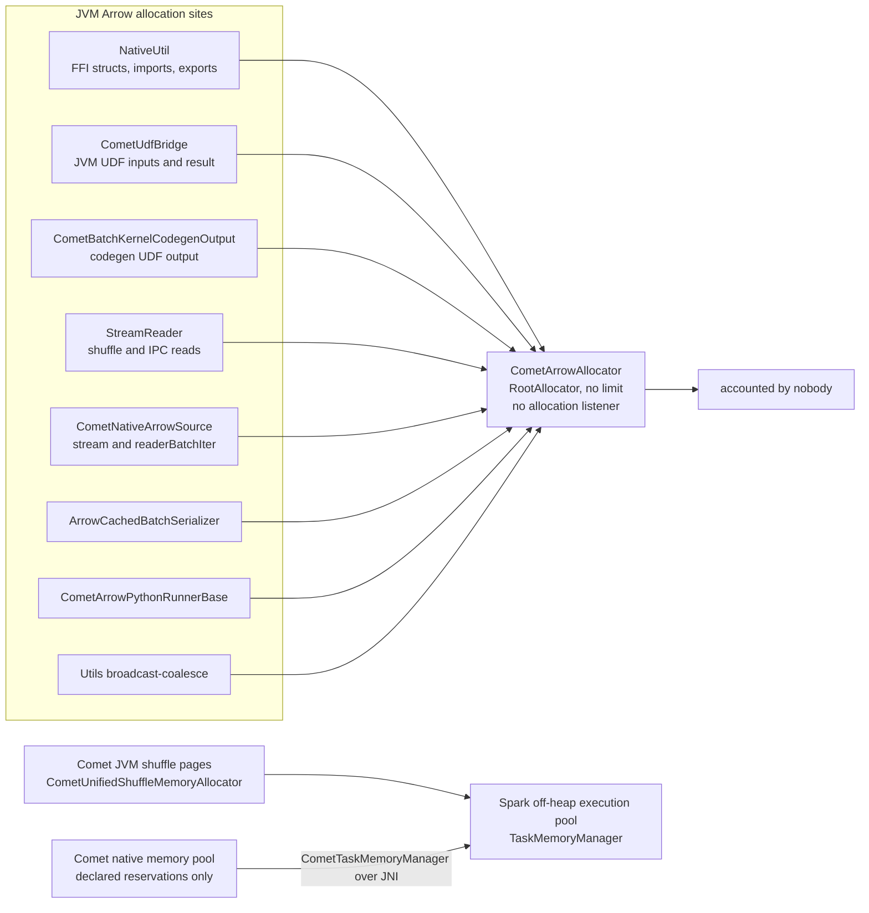
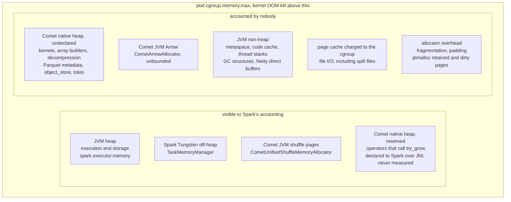

<!--
Licensed to the Apache Software Foundation (ASF) under one
or more contributor license agreements.  See the NOTICE file
distributed with this work for additional information
regarding copyright ownership.  The ASF licenses this file
to you under the Apache License, Version 2.0 (the
"License"); you may not use this file except in compliance
with the License.  You may obtain a copy of the License at

  http://www.apache.org/licenses/LICENSE-2.0

Unless required by applicable law or agreed to in writing,
software distributed under the License is distributed on an
"AS IS" BASIS, WITHOUT WARRANTIES OR CONDITIONS OF ANY
KIND, either express or implied.  See the License for the
specific language governing permissions and limitations
under the License.
-->

# Memory Management

This page describes how memory is budgeted, accounted, and enforced across the JVM/native
boundary. It is aimed at contributors working on memory pools, operators that reserve memory, or
anyone debugging an out-of-memory report. For user-facing tuning advice, see the
[Tuning Guide](../user-guide/latest/tuning.md).

This page covers off-heap mode (`spark.memory.offHeap.enabled=true`) only. Comet also has an
on-heap mode, but it exists so that the Spark SQL test suite can run against Comet without changing
Spark's memory configuration. Comet performs no memory accounting in it: the native side gets
DataFusion's `UnboundedMemoryPool` and the JVM shuffle allocator
(`CometUnboundedShuffleMemoryAllocator`) hands out `Unsafe` pages against no budget. Native memory
is not on the JVM heap, so there is no Spark pool it could honestly be charged to, and the
fixed-size pool that used to stand in for one bounded nothing the container cares about. On-heap
mode must not be used in production, and it is not described further here.

## Overview

A Comet executor has to satisfy three separate memory budgets at once, and they are enforced by
three different parties:

| Budget               | Enforced by       | What happens when it is exceeded                                              |
| -------------------- | ----------------- | ----------------------------------------------------------------------------- |
| JVM heap             | The JVM           | `java.lang.OutOfMemoryError`; Spark treats it as fatal and exits the executor |
| Spark's memory pools | Spark bookkeeping | A consumer is asked to spill, or the task fails with `SparkOutOfMemoryError`  |
| Container RSS        | The OS / cgroup   | `SIGKILL` of the whole executor process (exit 137, `OOMKilled`)               |

The first two are _accounting_: a running total of bytes that consumers have voluntarily declared.
The third is _physical_: the kernel measures resident pages and does not care what any accounting
layer believes.

The first row is easy to get wrong. Spark's `Executor.isFatalError` exempts `SparkOutOfMemoryError`,
which is the error Spark's own memory manager throws when a consumer cannot get the bytes it asked
for, so that failure is confined to the task and the executor keeps running. An ordinary JVM
`OutOfMemoryError` is not exempt: the executor hands it to `SparkUncaughtExceptionHandler`, which
calls `System.exit(SparkExitCode.OOM)` (exit code 52). Real heap exhaustion therefore usually costs
the whole executor, not one task. An executor loss on its own does not tell you which budget was
exceeded; the exit code does.

Comet's difficulty is that its allocations are made by Rust code, so no JVM allocator produces them
and no JVM metric measures them, yet they land squarely in container RSS. Comet therefore maintains
its own budget that is meant to shadow the physical one, and declares it to Spark so that the two
compete for a single number. The accuracy of that shadow is the central problem this page is about.

## Who allocates what

Enabling Comet does not add one new memory consumer, it adds several, and they are not all
accounted by the same party. This inventory is worth internalizing before reading the rest of the
page:

| Allocator                               | Lives in    | Bounded by                                                    | Visible to Spark? |
| --------------------------------------- | ----------- | ------------------------------------------------------------- | ----------------- |
| Spark execution + storage (on-heap)     | JVM heap    | `spark.executor.memory` and the unified memory manager        | Yes               |
| Spark Tungsten (off-heap)               | Off-heap    | `spark.memory.offHeap.size` via `TaskMemoryManager`           | Yes               |
| Comet native (Rust global allocator)    | Native heap | `memory_limit` (see below), enforced only via the memory pool | Reservations only |
| Comet JVM Arrow (`CometArrowAllocator`) | Off-heap    | **Nothing**: a `RootAllocator(Long.MaxValue)`                 | No                |
| Comet JVM shuffle pages                 | Off-heap    | `spark.memory.offHeap.size` via `TaskMemoryManager`           | Yes               |

Several observations follow.

**"Off-heap" and "native heap" are not the same thing.** Both sit outside the JVM heap and both
count toward container RSS, which is what makes them easy to conflate, but they differ in who
allocates the bytes and in who is able to see them.

- **Off-heap** is allocated by JVM code: `sun.misc.Unsafe` for Spark's Tungsten pages, and Arrow's
  Unsafe-backed allocator for Comet's Java Arrow buffers. A JVM-side allocator makes the call, so a
  JVM-side consumer is in a position to report it, and `spark.memory.offHeap.size` together with
  `TaskMemoryManager` arbitrates it.
- **Native heap** is allocated by Rust through its global allocator, in the same process. No JVM
  code makes the call, so no JVM-side allocator or metric ever measures these bytes. The only layer
  that sees any of them is Comet's own memory pool, and then only the portion that operators
  explicitly reserve. That portion is still charged to Spark, as the next paragraph describes; what
  is never reserved is measured by nothing and budgeted by nobody.

**The budget is shared even though the memory is not.** `memory_limit` is derived from
`spark.memory.offHeap.size` (see [Where Comet's budget comes from](#where-comets-budget-comes-from)),
and in both off-heap pool types every native reservation is forwarded to Spark's off-heap execution
pool over JNI. A native allocation therefore consumes the same accounting budget as a Tungsten page
while occupying entirely different memory. Raising `spark.memory.offHeap.size` raises the ceiling
for both at once, and raises the pod's memory request by the same amount.

**Comet's JVM-side Arrow allocator is unbounded and accounted by nobody.** `CometArrowAllocator`
(`spark/src/main/scala/org/apache/comet/package.scala`) is a single process-wide
`new RootAllocator(Long.MaxValue)`. Child allocators are cut from it for FFI stream export
(`CometNativeArrowSource`), broadcast coalescing, and `CometSparkToColumnarExec`. These are real
off-heap bytes in container RSS that neither Spark's `TaskMemoryManager` nor Comet's native memory
pool sees. In practice the volume is modest, a batch at a time per stream, but there is no
ceiling and no backpressure.

One further child, `CometArrowImportAllocator` (`comet-ffi-imports`), is what the Arrow C Data
Interface import path allocates from, so that tracing can report those charges apart from the rest
of Comet's Arrow memory. Unlike the others it is process-wide and never closed, because imported
buffers are reference counted and routinely outlive the task that imported them. Its reservation
is zero, so every byte still escalates to the root and the inventory above is unchanged by it.
Being charged there is not the same as having been allocated there; see the scaladoc on the
allocator before reading anything into the split.

**The JVM shuffle allocator is an ordinary Spark consumer.** `CometShuffleMemoryAllocator.getInstance`
returns `CometUnifiedShuffleMemoryAllocator`, a Spark `MemoryConsumer` drawing from
`spark.memory.offHeap.size`, so shuffle pages are arbitrated against Spark's other consumers in the
same task like any other allocation.

Which allocator each call site uses, and who ends up charged for the bytes:



### Constraints on a Comet memory consumer

`CometTaskMemoryManager` is the one place where Comet code acts as a Spark `MemoryConsumer`, and the
rules below are why it is written the way it is. Each is easy to break by accident.

**`getUsed` and `spill` must stay lock-free.** Spark calls both while already holding the
`TaskMemoryManager` monitor, which is why `NativeMemoryConsumer.getUsed` reads an `AtomicLong` and
`spill` returns without touching guarded state. A consumer that took a monitor of its own in either
method would risk a deadlock: a native reservation arriving over JNI on a Comet Tokio worker holds
Spark's monitor and would wait for the consumer's, while whatever held the consumer's waited for
Spark's. For the same reason, nothing reachable from a `spill` callback may allocate memory that
routes back through the same consumer.

**`scala.util.control.NonFatal` does not contain an acquisition.** `acquireExecutionMemory` fails in
three ways and `NonFatal` catches only the first. It runs other consumers' `spill`, where
`TaskMemoryManager` turns an interrupted spill into a `RuntimeException` and an `IOException` into a
`SparkOutOfMemoryError`, which extends `OutOfMemoryError` and is therefore an `Error`. Separately,
`ExecutionMemoryPool.acquireMemory` parks in `lock.wait()` when a task is below its fair share, so
killing a task raises a plain `InterruptedException`, which `NonFatal` excludes by name. Comet
reaches this method from native over JNI, so whatever escapes crosses the JNI boundary.

**Spark exposes no per-consumer usage figure.** `TaskMemoryManager.getMemoryConsumptionForThisTask`
is task-wide, and a consumer that reaches `acquireExecutionMemory` directly rather than through
`MemoryConsumer.acquireMemory` keeps an inherited `used` of zero. That is why `NativeMemoryConsumer`
overrides `getUsed` to report Comet's own tally instead: without it, Spark's spill-victim ordering
and `showMemoryUsage` would believe the consumer held nothing.

**A partial grant can be stranded.** `acquireExecutionMemory` takes its first grant from the pool
before asking other consumers to spill, so when a spill throws, the task has been charged for bytes
the call never returns. Nothing releases them until Spark's final task cleanup, so they are headroom
nobody can use for the rest of the task. Any caller that swallows the exception has to reconcile
that grant, and the only figure available for doing so is the task-wide one above.

**A consumer whose `spill` returns zero takes budget it can never give back.**
`NativeMemoryConsumer.spill` returns `0`, so Spark can select it as a spill victim and reclaim
nothing from it; it is only ever a spill trigger. The bytes it holds are real, so other consumers in
the same task see correspondingly less headroom and can spill earlier than they otherwise would.

## Where Comet's budget comes from

`CometExecIterator.getMemoryConfig` computes the budget once per executor and passes it across JNI
to `Java_org_apache_comet_Native_createPlan` as `memory_limit`. Comet shares Spark's off-heap pool
rather than asking for a separate allocation:

```text
memory_limit = spark.memory.offHeap.size * spark.comet.exec.memoryPool.fraction
```

`spark.comet.exec.memoryPool.fraction` defaults to `1.0` and is deprecated. It was documented as
the workaround for Comet's under-accounting (see [The accounting gap](#the-accounting-gap)), holding
back a slice of the off-heap pool for the memory Comet does not reserve, but it cannot do that:

- `greedy_unified` ignores `memory_limit`. It asks Spark for every byte it reserves.
- `fair_unified` applies it to each task's pool, limiting each memory consumer in the task to
  `memory_limit / num_consumers`. Spark's execution pool already limits each of N running tasks to
  `spark.memory.offHeap.size / N`, which is the tighter limit whenever more than one task is
  running, and the tasks together can still acquire the whole pool.
- Spark's own off-heap consumers, non-Comet operators and off-heap storage, draw on the same pool
  with no Comet limit at all.

The only room Spark leaves for memory outside the pool is `spark.executor.memoryOverhead`.

### Resolving the pool type

`parse_memory_pool_config` (`native/core/src/execution/memory_pools/config.rs`) turns the pool-type
string and the limit into a `MemoryPoolConfig`. Two pool types are valid in off-heap mode:

| Pool type                | Sized from          | Notes                                                 |
| ------------------------ | ------------------- | ----------------------------------------------------- |
| `fair_unified` (default) | `memory_limit`      | Delegates to Spark's `TaskMemoryManager`; task-shared |
| `greedy_unified`         | n/a (pool size `0`) | Spark owns the limit entirely; task-shared            |

Any other pool type is rejected with a configuration error. In on-heap mode the pool-type string is
ignored and the pool is always `UnboundedMemoryPool`.

## The pool stack

`create_memory_pool` builds a base pool and `createPlan` then wraps it in decorators. Reading from
the inside out, a Comet plan in the default configuration sees:

```text
[LoggingMemoryPool]        <- only when spark.comet.debug.memory=true
  [TaskSharedMemoryPool]   <- RAII handle for the per-task registry
    [TrackConsumersPool]   <- DataFusion; names the top 10 consumers in error messages
      [CometFairMemoryPool]  <- delegates acquire/release to Spark over JNI
```

Each decorator forwards every `MemoryPool` method to its inner pool, so `reserved()` at any level
reports the base pool's number.

### The unified pools

`CometUnifiedMemoryPool` and `CometFairMemoryPool` (`unified_pool.rs`, `fair_pool.rs`) are the
bridge to Spark. Their `try_grow` and `grow` both call `CometTaskMemoryManager.acquireMemory` over
JNI, which goes through Spark's ordinary `TaskMemoryManager`. That means:

- Comet competes with Spark's own off-heap consumers (Tungsten sorters, `BytesToBytesMap`, and so
  on) for the same `spark.memory.offHeap.size`, and Spark's unified memory manager arbitrates.
- Spark can force _Spark's_ consumers in the same task to spill to satisfy Comet's request.
- The reverse does not hold. Comet registers a `NativeMemoryConsumer` with the `TaskMemoryManager`
  so that Spark has something to charge, but its `spill()` always returns `0`
  (`CometTaskMemoryManager.java`). A Spark allocation can therefore never make a native sorter or
  aggregate release its reservations. Native operators spill only when their _own_ `try_grow`
  fails, so a JVM consumer that is blocked behind native reservations has no way to reclaim them.
- In `try_grow`, a partial grant (`acquired < additional`) is released immediately and reported as
  `ResourcesExhausted`, which is the signal DataFusion uses to spill.
- `grow` cannot fail, so when Spark grants less than asked the pool records the full amount anyway
  and carries the shortfall as _overcommit_ (`spark_memory.rs`). A later `shrink` repays the
  overcommit before returning anything to Spark, so Spark is never handed back more than it
  granted. While overcommit is outstanding, `try_grow` asks Spark for it on top of the request and
  is refused unless Spark can cover both, so operators spill until the debt is repaid. Both pools'
  `Display` output and their `try_grow` errors report the current overcommit.

`CometFairMemoryPool` additionally applies two local checks before it asks Spark, and refuses the
request without calling Spark if either fails:

- **The requesting consumer against its share.** The share is `pool_size` divided by the number of
  consumers currently registered with the pool. What the consumer already holds plus the request
  must not exceed it. That counts all of the consumer's reservations, including the sibling
  reservations that `new_empty()`, `split()` and `take()` create, so an operator that holds several
  reservations still gets one share. A sort's streaming merge, for example, creates one for each
  batch it reads. The pool keeps a running total for each consumer, because `reservation.size()`
  covers only one reservation. With an 8 GiB pool and two registered consumers, each share is
  4 GiB, so once one consumer holds 3 GiB the other can still reserve up to 4 GiB.
- **The pool's total against `pool_size`.** The shares alone do not bound the total, because a
  consumer keeps what it reserved while fewer consumers were registered. `pool_size` is computed
  for the executor but applied to each task's pool, so Spark's own limit on the task is at least as
  tight unless the deprecated `spark.comet.exec.memoryPool.fraction` is below `1.0`.

Two details matter for tuning:

- The pool is task-shared (see below), so `num_consumers` counts every registered consumer across
  every native plan in the task, not just the plan making the request. Registering a consumer
  lowers every other consumer's share, but does not take back memory they already hold.
- Every registered consumer gets a share, whether or not it can spill. DataFusion's
  `FairSpillPool` divides the pool among spillable consumers only.
  [Issue #5465](https://github.com/apache/datafusion-comet/issues/5465) tracks doing the same here.

This is why `fair_unified` can spill earlier than `greedy_unified`: a consumer at its share is
refused even when the rest of the pool is free, which keeps that memory for the task's other
consumers.

### Task-shared pools and their lifetime

A single Spark task can run more than one native plan at a time. A native shuffle is not one of
these cases, because its writer is planned together with the native operators that feed it. These
operators do split a task's native work into separate plans:

- `CometUnionExec` and `CometCoalesceExec` read their children through the JVM, so the native plan
  above them and the native plans below them are separate.
- `CometCollectLimitExec` and `CometTakeOrderedAndProjectExec` apply their limit in a native plan
  of their own, over the output of the plan below them.
- A native Parquet or Iceberg write runs its writer as a native plan of its own, over the output of
  the plan below it.

If each plan got its own pool, the per-task limit would be enforced once per plan rather than once
per task.

`acquire_task_shared_pool` (`task_shared.rs`) keeps a process-wide
`HashMap<task_attempt_id, Weak<TaskSharedMemoryPool>>`. Plans in the same task upgrade the existing
`Weak` and share one pool; the returned `Arc` is the only lifetime handle, so the registry entry
disappears when the last plan (and its last reservation) drops. There is no explicit release call to
forget, and a `createPlan` that fails partway through cleans up on unwind.

`TaskSharedMemoryPool::drop` has to handle one race: an `acquire` can observe an expired `Weak` and
insert a replacement before the dying pool reaches the registry lock. The drop therefore compares
pointers and only removes an entry that is still its own.

## How DataFusion consumes the pool

Native operators reserve through DataFusion's `MemoryConsumer` / `MemoryReservation` API:

- `try_grow(n)` may fail. Spillable operators (`ExternalSorter`, the grouped hash aggregate,
  sort-merge join) respond to a `ResourcesExhausted` error by spilling to disk and retrying. This is
  the only mechanism that turns memory pressure into progress rather than failure.
- `grow(n)` is infallible. It is used for memory that already exists and the caller cannot spill,
  such as a spilled batch read back from disk. The Comet pools record it even when Spark grants
  less, as overcommit (see [The unified pools](#the-unified-pools)).
- `shrink(n)` returns bytes to the pool.

An operator that never calls `try_grow` is invisible to the pool no matter how much memory it uses.

## Crossing the FFI boundary

Batches move between the JVM and native over the Arrow C Data and C Stream interfaces, which are
zero-copy. Nothing is copied, so the _allocator_ that produced a batch and the _runtime_ that
decides when it dies can be on opposite sides of the boundary. See [Arrow FFI](ffi.md) for the
mechanics; what matters here is who is charged and who controls the lifetime.

Two things are easy to conflate here. The _allocator_ of a buffer determines which process-level
accounting (if any) saw the bytes appear. Whether the buffer is _reserved_ in Comet's pool is a
separate decision, made by whichever operator holds it, and that operator neither knows nor cares
which side of the boundary the bytes came from.

**JVM → native (`ScanExec`).** The JVM allocates the Arrow buffers from a child of
`CometArrowAllocator` and exports the whole per-partition iterator once as an `ArrowArrayStream`.
`ScanExec` imports each batch through `AlignedArrowStreamReader` with `CopyMode::UnpackOrClone`:
dictionary columns are unpacked into new native arrays, everything else is an `Arc` clone of the
imported buffers. Those bytes stay where Java Arrow put them and are pinned for as long as any native
reference survives. They are invisible to Spark's `TaskMemoryManager`, and `CometArrowAllocator` is
unbounded, so nobody charged for them at allocation time. Whether they are charged _later_ depends
on who holds them. DataFusion's `ExternalSorter` reserves `get_reserved_bytes_for_record_batch` for
every batch it retains, and the hash join build side reserves `get_record_batch_memory_size` for
each incoming batch; both read buffer sizes off the `ArrayData` and apply equally to imported
buffers. So an imported batch that a sort or join has buffered _is_ reserved in Comet's pool, and
through a unified pool is charged to Spark. The same batch held by an operator that does not reserve
(a projection or filter, or `ScanExec` itself between polls) is charged to nothing.

**Native → JVM (`CometExecIterator`).** DataFusion produces the batch in Rust, and whether it is
still reserved when it reaches the boundary depends on the producing operator. The sort's output is
wrapped in a `ReservationStream` that shrinks the reservation by the batch's size as each batch is
emitted, so by the time `prepare_output` sees a sorted batch its bytes are no longer reserved.
`prepare_output` then calls `move_to_spark`, which writes an `FFI_ArrowArray` whose release callback
drops the Rust `ArrayData`; no reservation travels with it. The JVM wraps the pointers in
`ArrowBuf`s and the memory is freed when the JVM calls `close()`. An exported batch is therefore
usually _not_ pool-charged while the JVM holds it, but it is resident until the JVM releases it. A
slow or backed-up JVM consumer keeps native memory alive that no accounting layer is counting.

The point is not that one direction is charged and the other is not. **Buffer lifetime and
reservation lifetime are independent.** A reservation is a number an operator chose to declare and
later withdraw; a buffer lives until its last reference drops, on whichever side of the boundary
that happens. The two are kept in step only inside operators written to do so, and only while that
operator holds the batch. Once the batch leaves the operator, in either direction, the reservation
stops and the bytes keep going. That is the shape of the gap to hold in mind when reading the next
section, and it is what any fix at the allocator level has to close.

## The accounting gap

The pool tracks _declared reservations_. Container RSS counts _pages the process touched_. The two
diverge for several structural reasons:

- **Undeclared allocations.** Arrow array builders, expression kernels producing intermediate
  arrays, decompression buffers, Parquet metadata structures, `object_store` request buffers, and
  tokio's own machinery all allocate without reserving. Only operators that were explicitly written
  to reserve show up in the pool.
- **Rounding and padding.** Arrow buffers are padded to 64-byte boundaries and builders grow by
  doubling, so a reservation of exactly `n` bytes routinely corresponds to more than `n` bytes of
  heap.
- **Allocator behavior.** `malloc`-level fragmentation, size-class rounding, and jemalloc's
  retained/dirty page cache all add resident bytes that no layer above the allocator can see.
  Freeing memory does not necessarily return pages to the OS.
- **Non-Rust allocations.** Memory allocated by C dependencies through libc `malloc`, and anything
  `mmap`ed, never passes through Rust's `GlobalAlloc`, so neither the memory pool nor the
  allocation counters (`native_allocated`, `jemalloc_allocated`) see it. In a default build the C
  dependencies are libzstd (`zstd-sys`, behind the Parquet `zstd` codec), libhdfs (`hdfs-sys`,
  pulled in by the default `hdfs-opendal` feature), and the TLS stack used for cloud object stores
  (`aws-lc-sys`). Building with the `jemalloc` or `mimalloc` feature adds the allocator itself
  (`tikv-jemalloc-sys`, `libmimalloc-sys`). It is worth knowing which dependencies are _not_ C,
  because several names suggest otherwise: the other Parquet codecs are pure Rust in this build,
  `snap` for Snappy, `lz4_flex` for LZ4 and `zlib-rs` for gzip, as is `libbz2-rs-sys` despite its
  name, so those allocations do pass through `GlobalAlloc` and are counted.
- **Batches in flight across the FFI boundary.** Reservations stop at the operator that made them.
  Imported JVM batches are reserved only while a reserving operator holds them, and exported native
  batches have usually been released by the time the JVM receives them yet stay resident until the
  JVM closes them (see [Crossing the FFI boundary](#crossing-the-ffi-boundary)).
- **Overcommit.** Unlike everything above, this is not accidental. When Spark grants less than a
  `grow` asked for, Comet holds the difference anyway and deliberately does not tell Spark about it
  (see [The unified pools](#the-unified-pools)). `reserved()` includes it, but Spark's memory
  manager does not, so until it is repaid Spark can hand the same bytes to another consumer or task.
  The `overcommit` figure in the pool's `Display` output and `try_grow` errors shows how much is
  outstanding.

The practical consequence is that `reserved()` is a lower bound on Comet's real footprint, and the
gap is workload-dependent. The margin that covers it has to come from
`spark.executor.memoryOverhead`. The deprecated `spark.comet.exec.memoryPool.fraction` cannot provide
one; see [Where Comet's budget comes from](#where-comets-budget-comes-from).

To measure the gap on a real workload, read the executor's periodic memory usage log, which
reports the bytes Rust's allocator has handed out next to the pools' reservations; see
[Sizing the Overhead from the Memory Usage Log][memory-usage-log]. For a view per event rather
than per interval, enable tracing and compare `native_allocated` against
`comet_memory_reserved_total`; see [Tracing](tracing.md#analyzing-memory-usage).

[memory-usage-log]: ../user-guide/latest/tuning.md#sizing-the-overhead-from-the-memory-usage-log

## What the container sees

On Kubernetes, Spark sizes the executor pod from `ResourceProfile`:

```text
pod memory request = pod memory limit
                   = spark.executor.memory
                   + spark.executor.memoryOverhead   (default max(0.1 * executor.memory, 384 MiB))
                   + spark.memory.offHeap.size
                   + pyspark memory                  (Python applications only)
```

Both the request and the limit are set to this same value, so the pod's cgroup `memory.max` is a
hard ceiling on the sum of everything in the container. That cgroup counts, among other things:

- the JVM heap (`spark.executor.memory`),
- JVM non-heap: metaspace, code cache, thread stacks, GC structures, Netty direct buffers,
- Spark's own off-heap allocations,
- **all of Comet's native allocations**,
- Comet's JVM-side Arrow buffers (`CometArrowAllocator`),
- page cache charged to the cgroup by the container's file I/O, including spill files.

Everything the cgroup counts, and who accounts for each part:



Spark's accounting covers the first group, though not in the same sense throughout it. The JVM
heap, Tungsten pages and Comet's shuffle pages are allocated by JVM code that reports what it
allocated. A native reservation is a number an operator declared before allocating: `try_grow`
succeeds only once `CometTaskMemoryManager` has charged Spark's off-heap execution pool over JNI, so
the budget really is spent, but nothing measured the bytes and the reservation is only a lower bound
on them. The second group is outside every accounting layer.

When the total crosses `memory.max`, the kernel OOM killer kills the process. The failure mode is
significantly worse than a task-level OOM: every task running on that executor dies, every cached
block it held is lost and must be recomputed, and the shuffle files it produced become unavailable
to downstream fetches. Spark's driver sees only `ExecutorLostFailure` with exit code 137.

Two facts follow that are easy to get wrong:

1. **`spark.memory.offHeap.size` is part of the pod limit, not extra headroom on top of it.**
   Raising Comet's off-heap budget on Kubernetes raises the pod's memory request by the same
   amount, so the scheduler will place fewer executors per node rather than silently giving Comet
   more room.
2. **`spark.executor.memoryOverhead` is the only slack in the container**, and the JVM's own
   non-heap usage already consumes a large part of it. Comet's overshoot beyond its declared
   reservations eats into the same allowance.

YARN behaves analogously. The container size is the same sum, and the NodeManager kills containers
that exceed it, but the kill is done by the NodeManager's monitor rather than the kernel, so it is
somewhat less abrupt.

## Open problems

Nothing described above prevents an executor from being OOM-killed. Every enforcement point Comet
has bounds _declared reservations_, and the sections above describe several structural reasons why
declared reservations are a lower bound on physical usage. The known gaps, roughly in order of how
much they matter:

- **Real native usage is observed but not acted on.** Comet counts the bytes Rust's allocator has
  handed out, and each executor logs that count next to the pools' reservations. Nothing reads it
  at runtime, though: no operator, metric, or policy responds to it, so an executor that outgrows
  its container is still stopped only by the kill.
- **The memory overhead is sized by hand.** The gap has to fit in `spark.executor.memoryOverhead`,
  and the memory usage log measures it, but nothing sizes the overhead from it.
- **`CometArrowAllocator` is unbounded** and participates in no budget.
- **Buffer and reservation lifetimes are independent across the FFI boundary.** A batch can be
  resident on either side with no reservation covering it, because reservations are made and
  withdrawn by individual operators while the bytes outlive them.
- **Spark cannot trigger native spilling.** `NativeMemoryConsumer.spill()` returns `0`, so native
  reservations are released only when a native operator decides to spill on its own failed
  `try_grow`. JVM consumers in the same task can be starved behind them.

[Issue #4576](https://github.com/apache/datafusion-comet/issues/4576) tracks work on the first two.

## Debugging memory issues

| Tool                                                                                             | What it gives you                                                                           |
| ------------------------------------------------------------------------------------------------ | ------------------------------------------------------------------------------------------- |
| `spark.comet.debug.memory=true`                                                                  | `LoggingMemoryPool` logs every register/grow/shrink with the consumer name                  |
| `spark.comet.explain.native.enabled=true`                                                        | Native plan with per-operator metrics, including spill counts                               |
| [Memory usage log](../user-guide/latest/tuning.md#sizing-the-overhead-from-the-memory-usage-log) | Executor-wide native allocation vs pool reservations, logged every 10 seconds by default    |
| [Tracing](tracing.md#analyzing-memory-usage)                                                     | `native_allocated` vs `comet_memory_reserved_total` per event; the accounting gap over time |
| `TrackConsumersPool`                                                                             | Names the top 10 consumers in `ResourcesExhausted` messages (always on)                     |
| [`thresher`](https://github.com/cetra3/thresher)                                                 | Third-party crate that dumps a jemalloc heap profile at a threshold                         |

A checklist for triaging an executor OOM kill:

1. Confirm which budget was exceeded. Exit code 137 / `OOMKilled` on the pod is the cgroup. Exit
   code 52 with `java.lang.OutOfMemoryError` in the executor log is JVM heap exhaustion; Spark
   treats it as fatal, so the executor is lost either way and the exit code is what distinguishes
   them. A failed task with `SparkOutOfMemoryError` and a surviving executor is Spark's managed
   memory pool, which is the only one of the three that is recoverable at task level.
2. Compare `allocated` against `reserved` in the executor's `Comet native memory usage` log lines
   leading up to the kill, or `native_allocated` against `comet_memory_reserved_total` in a trace.
   A large excess points at undeclared native allocations; a small excess points at the budget
   simply being too small, or at the JVM side.
3. Check `spark.comet.batchSize` against the schema width. Peak memory scales with
   `batch_size * columns`, and wide or deeply nested schemas amplify it.
4. Check whether the operators involved can spill at all. `ShuffledHashJoin` cannot, so
   `spark.comet.exec.forceShuffledHashJoin=true` converts a spillable sort-merge join into one that
   is not.
