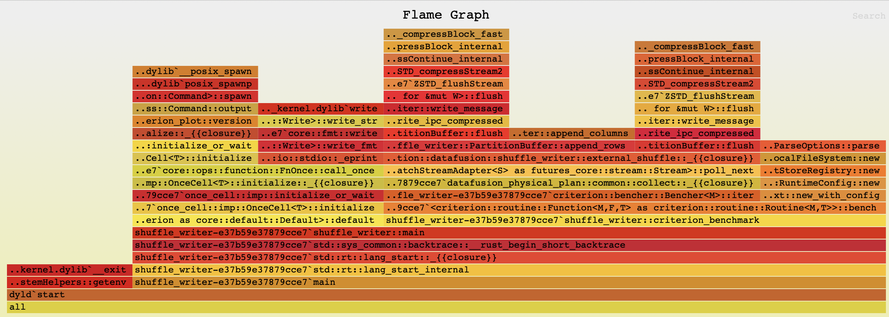

<!--
Licensed to the Apache Software Foundation (ASF) under one
or more contributor license agreements.  See the NOTICE file
distributed with this work for additional information
regarding copyright ownership.  The ASF licenses this file
to you under the Apache License, Version 2.0 (the
"License"); you may not use this file except in compliance
with the License.  You may obtain a copy of the License at

  http://www.apache.org/licenses/LICENSE-2.0

Unless required by applicable law or agreed to in writing,
software distributed under the License is distributed on an
"AS IS" BASIS, WITHOUT WARRANTIES OR CONDITIONS OF ANY
KIND, either express or implied.  See the License for the
specific language governing permissions and limitations
under the License.
-->

# Profiling Native Code

We use `cargo bench` to run benchmarks to measure the performance of individual operators and expressions
and [cargo-flamegraph](https://github.com/flamegraph-rs/flamegraph) for profiling.

## Running micro benchmarks with cargo bench

When implementing a new operator or expression, it is good practice to add a new microbenchmark under `core/benches`.

It is often easiest to copy an existing benchmark and modify it for the new operator or expression. It is also
necessary to add a new section to the `Cargo.toml` file, such as:

```toml
[[bench]]
name = "shuffle_writer"
harness = false
```

These benchmarks are useful when for comparing performance between releases or between feature branches and the
main branch to help prevent regressions in performance when adding new features or fixing bugs.

Individual benchmarks can be run by name with the following command.

```shell
cargo bench shuffle_writer
```

Here is some sample output from running this command.

```
     Running benches/shuffle_writer.rs (target/release/deps/shuffle_writer-e37b59e37879cce7)
Gnuplot not found, using plotters backend
shuffle_writer/shuffle_writer
                        time:   [2.0880 ms 2.0989 ms 2.1118 ms]
Found 9 outliers among 100 measurements (9.00%)
  3 (3.00%) high mild
  6 (6.00%) high severe
```

## Profiling with cargo-flamegraph

Install cargo-flamegraph:

```shell
cargo install flamegraph
```

Follow the instructions in [cargo-flamegraph](https://github.com/flamegraph-rs/flamegraph) for your platform for
running flamegraph.

Here is a sample command for running `cargo-flamegraph` on MacOS.

```shell
cargo flamegraph --root --bench shuffle_writer
```

This will produce output similar to the following.

```
dtrace: system integrity protection is on, some features will not be available

dtrace: description 'profile-997 ' matched 1 probe
Gnuplot not found, using plotters backend
Testing shuffle_writer/shuffle_writer
Success

dtrace: pid 66402 has exited
writing flamegraph to "flamegraph.svg"
```

The generated flamegraph can now be opened in a browser that supports svg format.

Here is the flamegraph for this example:


