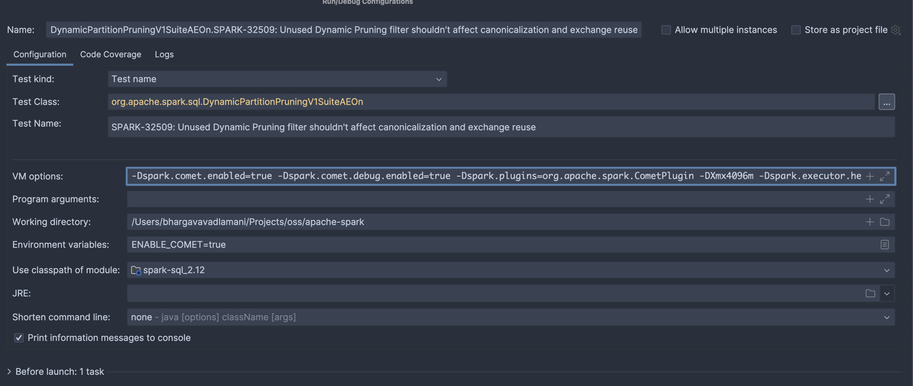

<!--
Licensed to the Apache Software Foundation (ASF) under one
or more contributor license agreements.  See the NOTICE file
distributed with this work for additional information
regarding copyright ownership.  The ASF licenses this file
to you under the Apache License, Version 2.0 (the
"License"); you may not use this file except in compliance
with the License.  You may obtain a copy of the License at

  http://www.apache.org/licenses/LICENSE-2.0

Unless required by applicable law or agreed to in writing,
software distributed under the License is distributed on an
"AS IS" BASIS, WITHOUT WARRANTIES OR CONDITIONS OF ANY
KIND, either express or implied.  See the License for the
specific language governing permissions and limitations
under the License.
-->

# Running Spark SQL Tests

Running Apache Spark's SQL tests with Comet enabled is a good way to ensure that Comet produces the same
results as that version of Spark. To enable this, we apply some changes to the Apache Spark source code so that
Comet is enabled when we run the tests.

Here is an overview of the changes that we need to make to Spark:

- Update the pom.xml to add a dependency on Comet
- Modify SparkSession to load the Comet extension
- Modify TestHive to load Comet
- Modify SQLTestUtilsBase to load Comet when `ENABLE_COMET` environment variable exists

Here are the steps involved in running the Spark SQL tests with Comet, using Spark 3.4.3 for this example.

## 1. Install Comet

Run `make release` in Comet to install the Comet JAR into the local Maven repository, specifying the Spark version.

```shell
PROFILES="-Pspark-3.4" make release
```

## 2. Clone Spark and Apply Diff

Clone Apache Spark locally and apply the diff file from Comet.

Note: this is a shallow clone of a tagged Spark commit and is not suitable for general Spark development.

```shell
git clone -b 'v3.4.3' --single-branch --depth 1 git@github.com:apache/spark.git apache-spark
cd apache-spark
git apply ../datafusion-comet/dev/diffs/3.4.3.diff
```

## 3. Run Spark SQL Tests

### Use the following commands to run the Spark SQL test suite locally.

Optionally, enable Comet fallback logging, so that all fallback reasons are logged at `WARN` level.

```shell
export ENABLE_COMET_LOG_FALLBACK_REASONS=true
```

```shell
ENABLE_COMET=true ENABLE_COMET_ONHEAP=true build/sbt catalyst/test
ENABLE_COMET=true ENABLE_COMET_ONHEAP=true build/sbt "sql/testOnly * -- -l org.apache.spark.tags.ExtendedSQLTest -l org.apache.spark.tags.SlowSQLTest"
ENABLE_COMET=true ENABLE_COMET_ONHEAP=true build/sbt "sql/testOnly * -- -n org.apache.spark.tags.ExtendedSQLTest"
ENABLE_COMET=true ENABLE_COMET_ONHEAP=true build/sbt "sql/testOnly * -- -n org.apache.spark.tags.SlowSQLTest"
ENABLE_COMET=true ENABLE_COMET_ONHEAP=true build/sbt "hive/testOnly * -- -l org.apache.spark.tags.ExtendedHiveTest -l org.apache.spark.tags.SlowHiveTest"
ENABLE_COMET=true ENABLE_COMET_ONHEAP=true build/sbt "hive/testOnly * -- -n org.apache.spark.tags.ExtendedHiveTest"
ENABLE_COMET=true ENABLE_COMET_ONHEAP=true build/sbt "hive/testOnly * -- -n org.apache.spark.tags.SlowHiveTest"
```
### Steps to run individual test suites through SBT
1. Open SBT with Comet enabled
```shell
ENABLE_COMET=true ENABLE_COMET_ONHEAP=true sbt -J-Xmx4096m -Dspark.test.includeSlowTests=true
```
2. Run individual tests (Below code runs test named `SPARK-35568` in the `spark-sql` module)
```shell
 sql/testOnly  org.apache.spark.sql.DynamicPartitionPruningV1SuiteAEOn -- -z "SPARK-35568"
```
### Steps to run individual test suites in IntelliJ IDE
1. Add below configuration in VM Options for your test case (apache-spark repository)
```shell
-Dspark.comet.enabled=true -Dspark.comet.debug.enabled=true -Dspark.plugins=org.apache.spark.CometPlugin -DXmx4096m -Dspark.executor.heartbeatInterval=20000 -Dspark.network.timeout=10000 --add-exports=java.base/sun.nio.ch=ALL-UNNAMED --add-opens=java.base/java.nio=ALL-UNNAMED
```
2. Set `ENABLE_COMET=true` in environment variables

3. After the above tests are configured, spark tests can be run with debugging enabled on spark/comet code. Note that Comet is added as a dependency and the classes are readonly while debugging from Spark. Any new changes to Comet are to be built and deployed locally through the command (`PROFILES="-Pspark-3.4" make release`)

## Creating a diff file for a new Spark version

Once Comet has support for a new Spark version, we need to create a diff file that can be applied to that version
of Apache Spark to enable Comet when running tests. This is a highly manual process and the process can
vary depending on the changes in the new version of Spark, but here is a general guide to the process.

We typically start by applying a patch from a previous version of Spark. For example, when enabling the tests
for Spark version 3.5.6 we may start by applying the existing diff for 3.5.5 first.

```shell
cd git/apache/spark
git checkout v3.5.6
git apply --reject --whitespace=fix ../datafusion-comet/dev/diffs/3.5.5.diff
```

Any changes that cannot be cleanly applied will instead be written out to reject files. For example, the above
command generated the following files.

```shell
find . -name "*.rej"
./pom.xml.rej
./sql/core/src/test/scala/org/apache/spark/sql/FileBasedDataSourceSuite.scala.rej
./sql/core/src/test/scala/org/apache/spark/sql/SubquerySuite.scala.rej
./sql/core/src/test/scala/org/apache/spark/sql/streaming/StreamingJoinSuite.scala.rej
./sql/core/src/test/scala/org/apache/spark/sql/streaming/StreamSuite.scala.rej
./sql/core/src/test/scala/org/apache/spark/sql/JoinSuite.scala.rej
./sql/core/src/test/scala/org/apache/spark/sql/execution/datasources/SchemaPruningSuite.scala.rej
./sql/core/src/test/scala/org/apache/spark/sql/execution/datasources/binaryfile/BinaryFileFormatSuite.scala.rej
./sql/core/src/test/scala/org/apache/spark/sql/execution/datasources/parquet/ParquetRebaseDatetimeSuite.scala.rej
./sql/core/src/test/scala/org/apache/spark/sql/execution/datasources/parquet/ParquetSchemaSuite.scala.rej
./sql/core/src/test/scala/org/apache/spark/sql/execution/WholeStageCodegenSuite.scala.rej
./sql/core/src/test/scala/org/apache/spark/sql/execution/adaptive/AdaptiveQueryExecSuite.scala.rej
./sql/core/src/test/scala/org/apache/spark/sql/sources/CreateTableAsSelectSuite.scala.rej
./sql/core/src/test/scala/org/apache/spark/sql/sources/BucketedReadSuite.scala.rej
./sql/core/src/test/scala/org/apache/spark/sql/sources/DisableUnnecessaryBucketedScanSuite.scala.rej
./sql/core/src/test/scala/org/apache/spark/sql/errors/QueryExecutionErrorsSuite.scala.rej
./sql/core/src/test/scala/org/apache/spark/sql/CachedTableSuite.scala.rej
./sql/core/src/main/scala/org/apache/spark/sql/SparkSession.scala.rej
```

The changes in these reject files need to be applied manually.

One method is to use the [wiggle](https://github.com/neilbrown/wiggle) command (`brew install wiggle` on Mac).

For example:

```shell
wiggle --replace ./sql/core/src/test/scala/org/apache/spark/sql/SubquerySuite.scala ./sql/core/src/test/scala/org/apache/spark/sql/SubquerySuite.scala.rej
```

## Generating The Diff File

The diff file can be generated using the `git diff` command. It may be necessary to set the `core.abbrev`
configuration setting to use 11 digits hashes for consistency with existing diff files.

Note that there is an `IgnoreComet.scala` that is not part of the Spark codebase, and therefore needs to be added 
using `git add` before generating the diff.

```shell
git config core.abbrev 11;
git add sql/core/src/test/scala/org/apache/spark/sql/IgnoreComet.scala
git diff v3.5.6 > ../datafusion-comet/dev/diffs/3.5.6.diff
```

## Running Tests in CI

The easiest way to run the tests is to create a PR against Comet and let CI run the tests. When working with a
new Spark version, the `spark_sql_test.yaml` and `spark_sql_test_ansi.yaml` files will need updating with the
new version.
