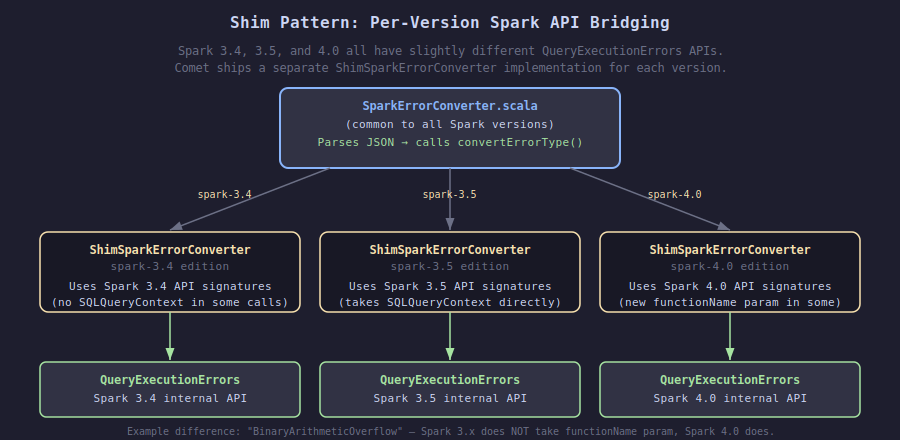

# ANSI SQL Error Propagation in Comet

## Overview

Apache Comet is a native query accelerator for Apache Spark. It runs SQL expressions in
**Rust** (via Apache DataFusion) instead of the JVM, which is much faster. But there's a
catch: when something goes wrong — say, a divide-by-zero or a type cast failure — the error
needs to travel from Rust code all the way back to the Spark/Scala/Java world as a proper
Spark exception with the right type, the right message, and even a pointer to the exact
character in the original SQL query where the error happened.

This document explains the end-to-end error-propagation pipeline.

---

## The Big Picture


```
SQL Query (Spark/Scala)
        │
        │  1. Spark serializes the plan + query context into Protobuf
        ▼
  Protobuf bytes ──────────────────────────────────►  JNI boundary
        │
        │  2. Rust deserializes the plan and registers query contexts
        ▼
   Native execution (DataFusion / Rust)
        │
        │  3. An error occurs (e.g. divide by zero)
        ▼
   SparkError (Rust enum)
        │
        │  4. Error is wrapped with SQL location context
        ▼
   SparkErrorWithContext
        │
        │  5. Serialized to JSON string
        ▼
   JSON string ◄────────────────────────────────────  JNI boundary
        │
        │  6. Thrown as CometQueryExecutionException
        ▼
   CometExecIterator.scala catches it
        │
        │  7. JSON is parsed, proper Spark exception is reconstructed
        ▼
   Spark exception (e.g. ArithmeticException with DIVIDE_BY_ZERO errorClass)
        │
        │  8. Spark displays it to the user with SQL location pointer
        ▼
   User sees:
   [DIVIDE_BY_ZERO] Division by zero.
   == SQL (line 1, position 8) ==
   SELECT a/b FROM t
          ^^^
```

---

## Step 1: Spark Serializes Query Context into Protobuf

When Spark compiles a SQL query, it parses it and attaches *origin* information to every
expression — the line number, column offset, and the full SQL text.

`QueryPlanSerde.scala` is the Scala code that converts Spark's physical execution plan into
a Protobuf binary that gets sent to the Rust side. It extracts origin information from each
expression and encodes it alongside the expression in the Protobuf payload.

### The `extractQueryContext` function

```scala
// spark/src/main/scala/org/apache/comet/serde/QueryPlanSerde.scala

private def extractQueryContext(expr: Expression): Option[ExprOuterClass.QueryContext] = {
  val contexts = expr.origin.getQueryContext       // Spark stores context in expr.origin
  if (contexts != null && contexts.length > 0) {
    val ctx = contexts(0)
    ctx match {
      case sqlCtx: SQLQueryContext =>
        val builder = ExprOuterClass.QueryContext.newBuilder()
          .setSqlText(sqlCtx.sqlText.getOrElse(""))         // full SQL text
          .setStartIndex(sqlCtx.originStartIndex.getOrElse(...)) // char offset of expression start
          .setStopIndex(sqlCtx.originStopIndex.getOrElse(...))   // char offset of expression end
          .setLine(sqlCtx.line.getOrElse(0))
          .setStartPosition(sqlCtx.startPosition.getOrElse(0))
        // ...
        Some(builder.build())
    }
  }
}
```

Then, for **every single expression** converted to Protobuf, a unique numeric ID and the
context are attached:

```scala
.map { protoExpr =>
  val builder = protoExpr.toBuilder
  builder.setExprId(nextExprId())           // unique ID (monotonically increasing counter)
  extractQueryContext(expr).foreach { ctx =>
    builder.setQueryContext(ctx)            // attach the SQL location info
  }
  builder.build()
}
```

### The Protobuf schema

```protobuf
// native/proto/src/proto/expr.proto

message Expr {
  optional uint64 expr_id = 89;             // unique ID for each expression
  optional QueryContext query_context = 90; // SQL location info
  // ... actual expression type ...
}

message QueryContext {
  string sql_text = 1;      // "SELECT a/b FROM t"
  int32 start_index = 2;    // 7  (0-based character index of 'a')
  int32 stop_index = 3;     // 9  (0-based character index of 'b', inclusive)
  int32 line = 4;           // 1  (1-based line number)
  int32 start_position = 5; // 7  (0-based column position)
  optional string object_type = 6; // e.g. "VIEW"
  optional string object_name = 7; // e.g. "v1"
}
```

---

## Step 2: Rust Deserializes the Plan and Registers Query Contexts

On the Rust side, `PhysicalPlanner` in `planner.rs` converts the Protobuf into DataFusion's
physical plan. A `QueryContextMap` — a global registry — maps expression IDs to their SQL
context.

### `QueryContextMap` (`native/spark-expr/src/query_context.rs`)

```rust
pub struct QueryContextMap {
    contexts: RwLock<HashMap<u64, Arc<QueryContext>>>,
}

impl QueryContextMap {
    pub fn register(&self, expr_id: u64, context: QueryContext) { ... }
    pub fn get(&self, expr_id: u64) -> Option<Arc<QueryContext>> { ... }
}
```

This is basically a lookup table: "for expression #42, the SQL context is: text=`SELECT a/b
FROM t`, characters 7–9, line 1, column 7".

### The `PhysicalPlanner` registers contexts during plan creation

```rust
// native/core/src/execution/planner.rs

pub struct PhysicalPlanner {
    query_context_registry: Arc<QueryContextMap>,
    // ...
}

pub(crate) fn create_expr(&self, spark_expr: &Expr, ...) {
    // 1. If this expression has a query context, register it
    if let (Some(expr_id), Some(ctx_proto)) =
        (spark_expr.expr_id, spark_expr.query_context.as_ref()) {
        let query_ctx = QueryContext::new(
            ctx_proto.sql_text.clone(),
            ctx_proto.start_index,
            ctx_proto.stop_index,
            ...
        );
        self.query_context_registry.register(expr_id, query_ctx);
    }

    // 2. When building specific expressions (Cast, CheckOverflow, etc.),
    //    look up the context and pass it to the expression
    ExprStruct::Cast(expr) => {
        let query_context = spark_expr.expr_id.and_then(|id| {
            self.query_context_registry.get(id)
        });
        Ok(Arc::new(Cast::new(child, datatype, options, spark_expr.expr_id, query_context)))
    }
}
```

---

## Step 3: An Error Occurs During Native Execution

During query execution, a Rust expression might encounter something like division by zero.

### The `SparkError` enum (`native/spark-expr/src/error.rs`)

This enum contains one variant for every kind of error Spark can produce, with exactly the
same error message format as Spark:

```rust
pub enum SparkError {
    #[error("[DIVIDE_BY_ZERO] Division by zero. Use `try_divide` to tolerate divisor \
        being 0 and return NULL instead. If necessary set \
        \"spark.sql.ansi.enabled\" to \"false\" to bypass this error.")]
    DivideByZero,

    #[error("[CAST_INVALID_INPUT] The value '{value}' of the type \"{from_type}\" \
        cannot be cast to \"{to_type}\" because it is malformed. ...")]
    CastInvalidValue { value: String, from_type: String, to_type: String },

    // ... 30+ more variants matching Spark's error codes ...
}
```

When a divide-by-zero happens, the arithmetic expression creates:

```rust
return Err(DataFusionError::External(Box::new(SparkError::DivideByZero)));
```

---

## Step 4: Error Gets Wrapped with SQL Context

The expression wrappers (`CheckedBinaryExpr`, `CheckOverflow`, `Cast`) catch the
`SparkError` and attach the SQL context using `SparkErrorWithContext`:

```rust
// native/core/src/execution/expressions/arithmetic.rs
// CheckedBinaryExpr wraps arithmetic operations

impl PhysicalExpr for CheckedBinaryExpr {
    fn evaluate(&self, batch: &RecordBatch) -> Result<...> {
        match self.child.evaluate(batch) {
            Err(DataFusionError::External(e)) if self.query_context.is_some() => {
                if let Some(spark_error) = e.downcast_ref::<SparkError>() {
                    // Wrap the error with SQL location info
                    let wrapped = SparkErrorWithContext::with_context(
                        spark_error.clone(),
                        Arc::clone(self.query_context.as_ref().unwrap()),
                    );
                    return Err(DataFusionError::External(Box::new(wrapped)));
                }
                Err(DataFusionError::External(e))
            }
            other => other,
        }
    }
}
```

### `SparkErrorWithContext` (`native/spark-expr/src/error.rs`)

```rust
pub struct SparkErrorWithContext {
    pub error: SparkError,                          // the actual error
    pub context: Option<Arc<QueryContext>>,         // optional SQL location
}
```

---

## Step 5: Error Is Serialized to JSON

When DataFusion propagates the error all the way up through the execution engine and it
reaches the JNI boundary, `throw_exception()` in `errors.rs` is called. It detects the
`SparkErrorWithContext` type and calls `.to_json()` on it:

```rust
// native/core/src/errors.rs

fn throw_exception(env: &mut JNIEnv, error: &CometError, ...) {
    match error {
        CometError::DataFusion {
            source: DataFusionError::External(e), ..
        } => {
            if let Some(spark_err_ctx) = e.downcast_ref::<SparkErrorWithContext>() {
                // Has SQL context → throw with JSON payload
                let json = spark_err_ctx.to_json();
                env.throw_new("org/apache/comet/exceptions/CometQueryExecutionException", json)
            } else if let Some(spark_err) = e.downcast_ref::<SparkError>() {
                // No SQL context → throw with JSON payload (no context field)
                throw_spark_error_as_json(env, spark_err)
            }
        }
        // ...
    }
}
```

The JSON looks like this for a divide-by-zero in `SELECT a/b FROM t`:

```json
{
  "errorType": "DivideByZero",
  "errorClass": "DIVIDE_BY_ZERO",
  "params": {},
  "context": {
    "sqlText": "SELECT a/b FROM t",
    "startIndex": 7,
    "stopIndex": 9,
    "line": 1,
    "startPosition": 7,
    "objectType": null,
    "objectName": null
  },
  "summary": "== SQL (line 1, position 8) ==\nSELECT a/b FROM t\n       ^^^"
}
```

---

## Step 6: Java Receives `CometQueryExecutionException`

On the Java side, a thin exception class carries the JSON string as its message:

```java
// common/src/main/java/org/apache/comet/exceptions/CometQueryExecutionException.java

public final class CometQueryExecutionException extends CometNativeException {
  public CometQueryExecutionException(String jsonMessage) {
    super(jsonMessage);
  }

  public boolean isJsonMessage() {
    String msg = getMessage();
    return msg != null && msg.trim().startsWith("{") && msg.trim().endsWith("}");
  }
}
```

---

## Step 7: Scala Converts JSON Back to a Real Spark Exception

`CometExecIterator.scala` is the Scala code that drives the native execution. Every time it
calls into the native engine for the next batch of data, it catches
`CometQueryExecutionException` and converts it:

```scala
// spark/src/main/scala/org/apache/comet/CometExecIterator.scala

try {
  nativeUtil.getNextBatch(...)
} catch {
  case e: CometQueryExecutionException =>
    logError(s"Native execution for task $taskAttemptId failed", e)
    throw SparkErrorConverter.convertToSparkException(e)   // converts JSON to real exception
}
```

### `SparkErrorConverter.scala` parses the JSON

```scala
// spark/src/main/scala/org/apache/comet/SparkErrorConverter.scala

def convertToSparkException(e: CometQueryExecutionException): Throwable = {
  val json = parse(e.getMessage)
  val errorJson = json.extract[ErrorJson]

  // Reconstruct Spark's SQLQueryContext from the embedded context
  val sparkContext: Array[QueryContext] = errorJson.context match {
    case Some(ctx) =>
      Array(SQLQueryContext(
        sqlText = Some(ctx.sqlText),
        line = Some(ctx.line),
        startPosition = Some(ctx.startPosition),
        originStartIndex = Some(ctx.startIndex),
        originStopIndex = Some(ctx.stopIndex),
        originObjectType = ctx.objectType,
        originObjectName = ctx.objectName))
    case None => Array.empty
  }

  // Delegate to version-specific shim
  convertErrorType(errorJson.errorType, errorClass, params, sparkContext, summary)
}
```

### `ShimSparkErrorConverter` calls the real Spark API

Because Spark's `QueryExecutionErrors` API changes between Spark versions (3.4, 3.5, 4.0),
there is a separate implementation per version (in `spark-3.4/`, `spark-3.5/`, `spark-4.0/`).



```scala
// spark/src/main/spark-3.5/org/apache/spark/sql/comet/shims/ShimSparkErrorConverter.scala

def convertErrorType(errorType: String, errorClass: String,
    params: Map[String, Any], context: Array[QueryContext], summary: String): Option[Throwable] = {

  errorType match {
    case "DivideByZero" =>
      Some(QueryExecutionErrors.divideByZeroError(sqlCtx(context)))
      // This is the REAL Spark method that creates the ArithmeticException
      // with the SQL context pointer. The error message will include
      // "== SQL (line 1, position 8) ==" etc.

    case "CastInvalidValue" =>
      Some(QueryExecutionErrors.castingCauseOverflowError(...))

    // ... all other error types ...

    case _ => None  // fallback to generic SparkException
  }
}
```

The Spark 3.5 shim vs the Spark 4.0 shim differ in subtle API ways:

```scala
// 3.5: binaryArithmeticCauseOverflowError does NOT take functionName
case "BinaryArithmeticOverflow" =>
  Some(QueryExecutionErrors.binaryArithmeticCauseOverflowError(
    params("value1").toString.toShort,
    params("symbol").toString,
    params("value2").toString.toShort))

// 4.0: overloadedMethod takes functionName parameter
case "BinaryArithmeticOverflow" =>
  Some(QueryExecutionErrors.binaryArithmeticCauseOverflowError(
    params("value1").toString.toShort,
    params("symbol").toString,
    params("value2").toString.toShort,
    params("functionName").toString))   // extra param in 4.0
```

---

## Step 8: The User Sees a Proper Spark Error

The final exception that propagates out of Spark looks exactly like what native Spark would
produce for the same error, including the ANSI error code and the SQL pointer:

```
org.apache.spark.SparkArithmeticException: [DIVIDE_BY_ZERO] Division by zero.
Use `try_divide` to tolerate divisor being 0 and return NULL instead.
If necessary set "spark.sql.ansi.enabled" to "false" to bypass this error.

== SQL (line 1, position 8) ==
SELECT a/b FROM t
       ^^^
```

---

## Key Data Structures: A Summary

| Structure | Language | File | Purpose |
|---|---|---|---|
| `QueryContext` (proto) | Protobuf | `expr.proto` | Wire format for SQL location info |
| `QueryContext` (Rust) | Rust | `query_context.rs` | In-memory SQL location info |
| `QueryContextMap` | Rust | `query_context.rs` | Registry: expr_id → QueryContext |
| `SparkError` | Rust | `error.rs` | Typed Rust enum matching all Spark error variants |
| `SparkErrorWithContext` | Rust | `error.rs` | SparkError + optional QueryContext |
| `CometQueryExecutionException` | Java | `CometQueryExecutionException.java` | JNI transport: carries JSON string |
| `SparkErrorConverter` | Scala | `SparkErrorConverter.scala` | Parses JSON, creates real Spark exception |
| `ShimSparkErrorConverter` | Scala | `ShimSparkErrorConverter.scala` | Per-Spark-version calls to `QueryExecutionErrors.*` |

---

## Why JSON? Why Not Throw the Right Exception Directly?

JNI does not support throwing arbitrary Java exception subclasses from Rust directly — you
can only provide a class name and a string message. The class name is fixed (always
`CometQueryExecutionException`), but the string payload can carry any structured data.

JSON was chosen because:
1. It is self-describing — the receiver can parse it without knowing the structure in advance.
2. It is easy to add new fields without breaking old parsers.
3. It maps cleanly to Scala's case class extraction (`json.extract[ErrorJson]`).
4. All the typed information (error class, parameters, SQL context) can be round-tripped
   perfectly.

The alternative — throwing different Java exception classes from Rust — would require a
separate JNI throw path for each of the 30+ error types, which would be much harder to
maintain.

---

## Why `SparkError` Has Its Own `error_class()` Method

Each `SparkError` variant knows its own ANSI error class code (e.g. `"DIVIDE_BY_ZERO"`,
`"CAST_INVALID_INPUT"`). This is used both:
- In the JSON payload's `"errorClass"` field (so the Java side can pass it to
  `SparkException(errorClass = ...)` as a fallback)
- In the legacy `exception_class()` method that maps to the right Java exception class (e.g.
  `"java/lang/ArithmeticException"`)

---

## Diagrams

### End-to-End Pipeline


### QueryContext Journey: From SQL Text to Error Pointer


### Shim Pattern: Per-Version Spark API Bridging


---

*This document and its diagrams were written by [Claude](https://claude.ai) (Anthropic).*
