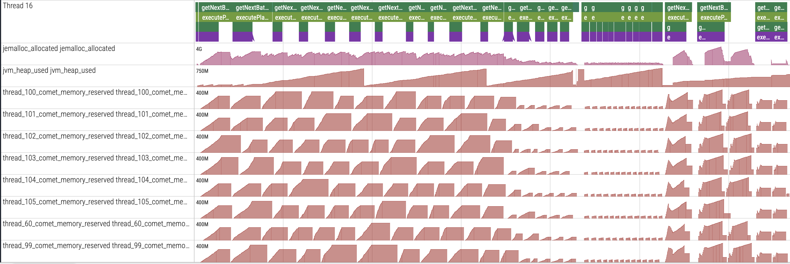

<!--
Licensed to the Apache Software Foundation (ASF) under one
or more contributor license agreements.  See the NOTICE file
distributed with this work for additional information
regarding copyright ownership.  The ASF licenses this file
to you under the Apache License, Version 2.0 (the
"License"); you may not use this file except in compliance
with the License.  You may obtain a copy of the License at

  http://www.apache.org/licenses/LICENSE-2.0

Unless required by applicable law or agreed to in writing,
software distributed under the License is distributed on an
"AS IS" BASIS, WITHOUT WARRANTIES OR CONDITIONS OF ANY
KIND, either express or implied.  See the License for the
specific language governing permissions and limitations
under the License.
-->

# Tracing

Tracing can be enabled by setting `spark.comet.tracing.enabled=true`.

With this feature enabled, each Spark executor will write a JSON event log file in
Chrome's [Trace Event Format]. The file will be written to the executor's current working
directory with the filename `comet-event-trace.json`.

[Trace Event Format]: https://docs.google.com/document/d/1CvAClvFfyA5R-PhYUmn5OOQtYMH4h6I0nSsKchNAySU/preview?tab=t.0#heading=h.yr4qxyxotyw

Additionally, enabling the `jemalloc` feature will enable tracing of native memory allocations.

```shell
make release COMET_FEATURES="jemalloc"
```

Example output:

```json
{ "name": "decodeShuffleBlock", "cat": "PERF", "ph": "B", "pid": 1, "tid": 5, "ts": 10109225730 },
{ "name": "decodeShuffleBlock", "cat": "PERF", "ph": "E", "pid": 1, "tid": 5, "ts": 10109228835 },
{ "name": "decodeShuffleBlock", "cat": "PERF", "ph": "B", "pid": 1, "tid": 5, "ts": 10109245928 },
{ "name": "decodeShuffleBlock", "cat": "PERF", "ph": "E", "pid": 1, "tid": 5, "ts": 10109248843 },
{ "name": "executePlan", "cat": "PERF", "ph": "E", "pid": 1, "tid": 5, "ts": 10109350935 },
{ "name": "getNextBatch[JVM] stage=2", "cat": "PERF", "ph": "E", "pid": 1, "tid": 5, "ts": 10109367116 },
{ "name": "getNextBatch[JVM] stage=2", "cat": "PERF", "ph": "B", "pid": 1, "tid": 5, "ts": 10109479156 },
```

Traces can be viewed with [Perfetto UI].

[Perfetto UI]: https://ui.perfetto.dev

Example trace visualization:



## Analyzing Memory Usage

The `analyze_trace` tool parses a trace log and compares jemalloc usage against the sum of per-thread
Comet memory pool reservations. This is useful for detecting untracked native memory growth where jemalloc
allocations exceed what the memory pools account for.

Build and run:

```shell
cd native
cargo run --bin analyze_trace -- /path/to/comet-event-trace.json
```

The tool reads counter events from the trace log. Because tracing logs metrics per thread, `jemalloc_allocated`
is a process-wide value (the same global allocation reported from whichever thread logs it), while
`thread_NNN_comet_memory_reserved` values are per-thread pool reservations that are summed to get the total
tracked memory.

Sample output:

```
=== Comet Trace Memory Analysis ===

Counter events parsed: 193104
Threads with memory pools: 8
Peak jemalloc allocated:   3068.2 MB
Peak pool total:           2864.6 MB
Peak excess (jemalloc - pool): 364.6 MB

WARNING: jemalloc exceeded pool reservation at 138 sampled points:

     Time (us)        jemalloc      pool_total          excess
--------------------------------------------------------------
        179578        210.8 MB          0.1 MB        210.7 MB
        429663        420.5 MB        145.1 MB        275.5 MB
       1304969       2122.5 MB       1797.2 MB        325.2 MB
      21974838        407.0 MB         42.3 MB        364.6 MB
      33543599          5.5 MB          0.1 MB          5.3 MB

--- Final per-thread pool reservations ---

  thread_60_comet_memory_reserved: 0.0 MB
  thread_95_comet_memory_reserved: 0.0 MB
  thread_96_comet_memory_reserved: 0.0 MB
  ...

  Total: 0.0 MB
```

Some excess is expected (jemalloc metadata, fragmentation, non-pool allocations like Arrow IPC buffers).
Large or growing excess may indicate memory that is not being tracked by the pool.

## Definition of Labels

| Label                            | Meaning                                                                                      |
| -------------------------------- | -------------------------------------------------------------------------------------------- |
| jvm_heap_used                    | JVM heap memory usage of live objects for the executor process                               |
| jemalloc_allocated               | Native memory usage for the executor process (requires `jemalloc` feature)                   |
| thread_NNN_comet_memory_reserved | Memory reserved by Comet's DataFusion memory pool (summed across all contexts on the thread). NNN is the Rust thread ID. |
| thread_NNN_comet_jvm_shuffle     | Off-heap memory allocated by Comet for columnar shuffle. NNN is the Rust thread ID.          |
