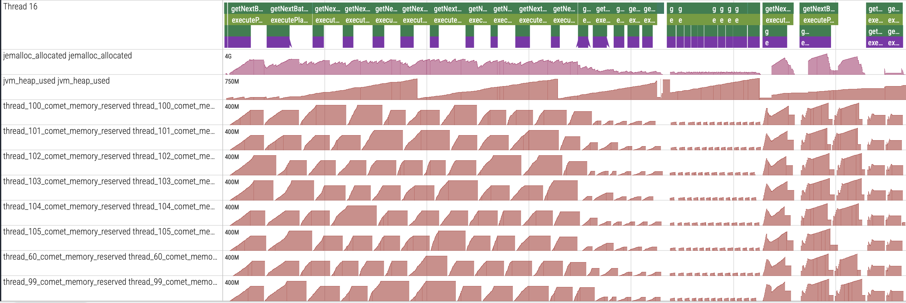

<!--
Licensed to the Apache Software Foundation (ASF) under one
or more contributor license agreements.  See the NOTICE file
distributed with this work for additional information
regarding copyright ownership.  The ASF licenses this file
to you under the Apache License, Version 2.0 (the
"License"); you may not use this file except in compliance
with the License.  You may obtain a copy of the License at

  http://www.apache.org/licenses/LICENSE-2.0

Unless required by applicable law or agreed to in writing,
software distributed under the License is distributed on an
"AS IS" BASIS, WITHOUT WARRANTIES OR CONDITIONS OF ANY
KIND, either express or implied.  See the License for the
specific language governing permissions and limitations
under the License.
-->

# Tracing

Tracing can be enabled by setting `spark.comet.tracing.enabled=true`.

With this feature enabled, each Spark executor will write a JSON event log file in
Chrome's [Trace Event Format]. The file will be written to the executor's current working
directory with the filename `comet-event-trace.json`.

[Trace Event Format]: https://docs.google.com/document/d/1CvAClvFfyA5R-PhYUmn5OOQtYMH4h6I0nSsKchNAySU/preview?tab=t.0#heading=h.yr4qxyxotyw

Additionally, enabling the `jemalloc` feature will enable tracing of native memory allocations.

```shell
make release COMET_FEATURES="jemalloc"
```

The `alloc-accounting` feature adds a second, allocator-independent measure of native memory. It
wraps whichever global allocator the build selected and reports the bytes it has handed out as
`native_allocated`. Unlike `jemalloc_allocated` it does not require jemalloc, and it counts only
what Rust code allocated, so it can be compared against the memory pool's reservations without the
allocator's own caching in the way. The two features are independent and can be combined:

```shell
make release COMET_FEATURES="jemalloc,alloc-accounting"
```

Example output:

```json
{ "name": "decodeShuffleBlock", "cat": "PERF", "ph": "B", "pid": 1, "tid": 5, "ts": 10109225730 },
{ "name": "decodeShuffleBlock", "cat": "PERF", "ph": "E", "pid": 1, "tid": 5, "ts": 10109228835 },
{ "name": "decodeShuffleBlock", "cat": "PERF", "ph": "B", "pid": 1, "tid": 5, "ts": 10109245928 },
{ "name": "decodeShuffleBlock", "cat": "PERF", "ph": "E", "pid": 1, "tid": 5, "ts": 10109248843 },
{ "name": "executePlan", "cat": "PERF", "ph": "E", "pid": 1, "tid": 5, "ts": 10109350935 },
{ "name": "getNextBatch[JVM] stage=2", "cat": "PERF", "ph": "E", "pid": 1, "tid": 5, "ts": 10109367116 },
{ "name": "getNextBatch[JVM] stage=2", "cat": "PERF", "ph": "B", "pid": 1, "tid": 5, "ts": 10109479156 },
```

Traces can be viewed with [Perfetto UI].

[Perfetto UI]: https://ui.perfetto.dev

Example trace visualization:



## Analyzing Memory Usage

The `analyze_trace` tool parses a trace log and compares the process-wide native allocation counter against
the sum of per-thread Comet memory pool reservations. This is useful for detecting untracked native memory
growth where native allocations exceed what the memory pools account for.

Build and run:

```shell
cd native
cargo run --bin analyze_trace -- /path/to/comet-event-trace.json
```

The tool reads counter events from the trace log. Because tracing logs metrics per thread, `native_allocated`
and `jemalloc_allocated` are process-wide values (the same global allocation reported from whichever thread
logs it), while `thread_NNN_comet_memory_reserved` values are per-thread pool reservations that are summed to
get the total tracked memory. The tool analyzes `native_allocated` when the trace contains it, since that
counts only what Rust code holds from the allocator, and otherwise falls back to `jemalloc_allocated`. The
output names the counter it used. A trace with neither counter is rejected.

Sample output:

```
=== Comet Trace Memory Analysis ===

Counter events parsed: 193104
Allocation counter:    jemalloc_allocated
Threads with memory pools: 8
Peak jemalloc_allocated:   3068.2 MB
Peak pool total:           2864.6 MB
Peak excess (jemalloc_allocated - pool): 364.6 MB

WARNING: jemalloc_allocated exceeded pool reservation at 138 sampled points:

     Time (us)  jemalloc_allocated      pool_total          excess
------------------------------------------------------------------
        179578            210.8 MB          0.1 MB        210.7 MB
        429663            420.5 MB        145.1 MB        275.5 MB
       1304969           2122.5 MB       1797.2 MB        325.2 MB
      21974838            407.0 MB         42.3 MB        364.6 MB
      33543599              5.5 MB          0.1 MB          5.3 MB

--- Final per-thread pool reservations ---

  thread_60_comet_memory_reserved: 0.0 MB
  thread_95_comet_memory_reserved: 0.0 MB
  thread_96_comet_memory_reserved: 0.0 MB
  ...

  Total: 0.0 MB
```

Some excess is expected (allocator metadata and fragmentation for `jemalloc_allocated`, and non-pool
allocations like Arrow IPC buffers for either counter). Large or growing excess may indicate memory that is
not being tracked by the pool.

Arrow memory on the JVM side is reported separately, because it is off-heap and so invisible to
`jvm_heap_used`. Comet imports batches from native over the Arrow C Data Interface, and Arrow
charges a buffer to whichever allocator owns it, so those imports are taken against a dedicated
child allocator and reported as `jvm_arrow_imported`, within the `jvm_arrow_allocated` total.

Both are allocator charges. They report what each allocator is accountable for, not where the bytes
were allocated, and their difference is not a bound on the Arrow memory the JVM allocated itself.
Ownership and allocation come apart in both directions:

- Bytes the JVM allocated get charged to the import allocator. Arrow's importer allocates the
  owning `ArrowArray` struct there, and `BitVectorHelper.loadValidityBuffer` allocates a validity
  bitmap there when an imported vector is all-valid or all-null and carries no validity buffer
  (512 bytes per 4096 rows).
- Imported bytes get charged to the root. An ownership transfer re-parents a charge without moving
  the payload, so a vector that shares buffers with an import, such as a slice of a UDF input, can
  leave the root accountable for memory the producer allocated.

For the same reason neither counter is a count of unique physical bytes, and `jvm_arrow_imported`
is not guaranteed to be included in `native_allocated`. Usually the producer is Rust and the bytes
are counted in both, but a buffer that Comet exported to native and that native passed back by
reference is imported without the Rust allocator ever having handed it out. Finally, the two
counters are separate reads of process-wide state, so concurrent tasks can change them between
samples: they are not an atomic per-query balance, and neither is a measure of RSS.

## Definition of Labels

| Label                            | Meaning                                                                                                                                                                           |
| -------------------------------- | --------------------------------------------------------------------------------------------------------------------------------------------------------------------------------- |
| jvm_heap_used                    | JVM heap memory usage of live objects for the executor process                                                                                                                    |
| jemalloc_allocated               | Native memory usage for the executor process (requires `jemalloc` feature)                                                                                                        |
| jvm_arrow_allocated              | Bytes charged to Comet's Arrow allocator tree on the JVM, including buffers imported from native over the Arrow C Data Interface                                                  |
| jvm_arrow_imported               | Bytes charged to the Arrow C Data Interface import allocator, a subset of `jvm_arrow_allocated`. An allocator charge, not a measure of where the bytes were allocated; see above. |
| native_allocated                 | Bytes handed out by the Rust global allocator, process-wide (requires `alloc-accounting` feature). Approximate to within 64 KiB of un-flushed delta per live thread.              |
| thread_NNN_comet_memory_reserved | Memory reserved by Comet's DataFusion memory pool (summed across all contexts on the thread). NNN is the Rust thread ID.                                                          |
| thread_NNN_comet_jvm_shuffle     | Off-heap memory allocated by Comet for columnar shuffle. NNN is the Rust thread ID.                                                                                               |
