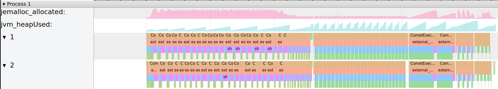

<!--
Licensed to the Apache Software Foundation (ASF) under one
or more contributor license agreements.  See the NOTICE file
distributed with this work for additional information
regarding copyright ownership.  The ASF licenses this file
to you under the Apache License, Version 2.0 (the
"License"); you may not use this file except in compliance
with the License.  You may obtain a copy of the License at

  http://www.apache.org/licenses/LICENSE-2.0

Unless required by applicable law or agreed to in writing,
software distributed under the License is distributed on an
"AS IS" BASIS, WITHOUT WARRANTIES OR CONDITIONS OF ANY
KIND, either express or implied.  See the License for the
specific language governing permissions and limitations
under the License.
-->

# Tracing

Tracing can be enabled by setting `spark.comet.tracing.enabled=true`. 

With this feature enabled, each Spark executor will write a JSON event log file in
Chrome's [Trace Event Format]. The file will be written to the executor's current working 
directory with the filename `comet-event-trace.json`.

[Trace Event Format]: https://docs.google.com/document/d/1CvAClvFfyA5R-PhYUmn5OOQtYMH4h6I0nSsKchNAySU/preview?tab=t.0#heading=h.yr4qxyxotyw

Additionally, enabling the `jemalloc` feature will enable tracing of native memory allocations.

```shell
make release COMET_FEATURES="jemalloc"
```

Example output:

```json
{ "name": "decodeShuffleBlock", "cat": "PERF", "ph": "B", "pid": 1, "tid": 5, "ts": 10109225730 },
{ "name": "decodeShuffleBlock", "cat": "PERF", "ph": "E", "pid": 1, "tid": 5, "ts": 10109228835 },
{ "name": "decodeShuffleBlock", "cat": "PERF", "ph": "B", "pid": 1, "tid": 5, "ts": 10109245928 },
{ "name": "decodeShuffleBlock", "cat": "PERF", "ph": "E", "pid": 1, "tid": 5, "ts": 10109248843 },
{ "name": "execute_plan", "cat": "PERF", "ph": "E", "pid": 1, "tid": 5, "ts": 10109350935 },
{ "name": "CometExecIterator_getNextBatch", "cat": "PERF", "ph": "E", "pid": 1, "tid": 5, "ts": 10109367116 },
{ "name": "CometExecIterator_getNextBatch", "cat": "PERF", "ph": "B", "pid": 1, "tid": 5, "ts": 10109479156 },
```

Traces can be viewed with [Trace Viewer]. 

[Trace Viewer]: https://github.com/catapult-project/catapult/blob/main/tracing/README.md

Example trace visualization:



## Definition of Labels

| Label               | Meaning                                                 |
|---------------------|---------------------------------------------------------|
| jvm_heapUsed        | JVM heap memory usage of live objects                   |
| task_memory_comet   | Off-heap memory allocated by Comet for query execution  |
| task_memory_spark   | On-heap & Off-heap memory allocated by Spark            |
| offheap_shuffle_NNN | Off-heap memory allocated by Comet for columnar shuffle |

