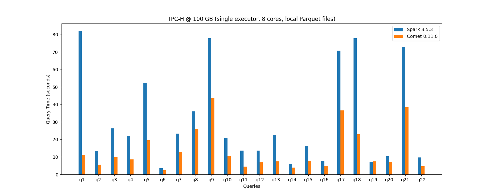

<!--
Licensed to the Apache Software Foundation (ASF) under one
or more contributor license agreements.  See the NOTICE file
distributed with this work for additional information
regarding copyright ownership.  The ASF licenses this file
to you under the Apache License, Version 2.0 (the
"License"); you may not use this file except in compliance
with the License.  You may obtain a copy of the License at

  http://www.apache.org/licenses/LICENSE-2.0

Unless required by applicable law or agreed to in writing,
software distributed under the License is distributed on an
"AS IS" BASIS, WITHOUT WARRANTIES OR CONDITIONS OF ANY
KIND, either express or implied.  See the License for the
specific language governing permissions and limitations
under the License.
-->

# Comet Accelerator for Apache Spark and Apache Iceberg

<!-- Code from https://buttons.github.io/ -->
<p>
  <!-- Place this tag where you want the button to render. -->
  <a class="github-button" href="https://github.com/apache/datafusion-comet" data-size="large" data-show-count="true" aria-label="Star apache/datafusion-comet on GitHub">Star</a>
  <!-- Place this tag where you want the button to render. -->
   <a class="github-button" href="https://github.com/apache/datafusion-comet/fork" data-size="large" data-show-count="true" aria-label="Fork apache/datafusion-comet on GitHub">Fork</a>
</p>

Apache DataFusion Comet is a high-performance accelerator for Apache Spark, built on top of the powerful
[Apache DataFusion] query engine. Comet is designed to significantly enhance the
performance of Apache Spark workloads while leveraging commodity hardware and seamlessly integrating with the
Spark ecosystem without requiring any code changes.

Comet also accelerates Apache Iceberg, when performing Parquet scans from Spark.

[Apache DataFusion]: https://datafusion.apache.org

## Run Spark Queries at DataFusion Speeds

Comet delivers a performance speedup for many queries, enabling faster data processing and shorter time-to-insights.

The following chart shows the time it takes to run the 22 TPC-H queries against 100 GB of data in Parquet format
using a single executor with 8 cores. See the [Comet Benchmarking Guide](https://datafusion.apache.org/comet/contributor-guide/benchmarking.html)
for details of the environment used for these benchmarks.

When using Comet, the overall run time is reduced from 687 seconds to 302 seconds, a 2.2x speedup.


Here is a breakdown showing relative performance of Spark and Comet for each TPC-H query.



These benchmarks can be reproduced in any environment using the documentation in the
[Comet Benchmarking Guide](/contributor-guide/benchmarking.md). We encourage
you to run your own benchmarks.

## Use Commodity Hardware

Comet leverages commodity hardware, eliminating the need for costly hardware upgrades or
specialized hardware accelerators, such as GPUs or FPGA. By maximizing the utilization of commodity hardware, Comet
ensures cost-effectiveness and scalability for your Spark deployments.

## Spark Compatibility

Comet aims for 100% compatibility with all supported versions of Apache Spark, allowing you to integrate Comet into
your existing Spark deployments and workflows seamlessly. With no code changes required, you can immediately harness
the benefits of Comet's acceleration capabilities without disrupting your Spark applications.

## Tight Integration with Apache DataFusion

Comet tightly integrates with the core Apache DataFusion project, leveraging its powerful execution engine. With
seamless interoperability between Comet and DataFusion, you can achieve optimal performance and efficiency in your
Spark workloads.

## Active Community

Comet boasts a vibrant and active community of developers, contributors, and users dedicated to advancing the
capabilities of Apache DataFusion and accelerating the performance of Apache Spark.

## Getting Started

To get started with Apache DataFusion Comet, follow the
[installation instructions](https://datafusion.apache.org/comet/user-guide/installation.html). Join the
[DataFusion Slack and Discord channels](https://datafusion.apache.org/contributor-guide/communication.html) to connect
with other users, ask questions, and share your experiences with Comet.

Follow [Apache DataFusion Comet Overview](https://datafusion.apache.org/comet/user-guide/overview.html) to get more detailed information

## Contributing

We welcome contributions from the community to help improve and enhance Apache DataFusion Comet. Whether it's fixing
bugs, adding new features, writing documentation, or optimizing performance, your contributions are invaluable in
shaping the future of Comet. Check out our
[contributor guide](https://datafusion.apache.org/comet/contributor-guide/contributing.html) to get started.

```{toctree}
:maxdepth: 1
:caption: Index
:hidden:

Comet Overview <about/index>
User Guide <user-guide/index>
Contributor Guide <contributor-guide/index>
ASF Links <asf/index>
```
