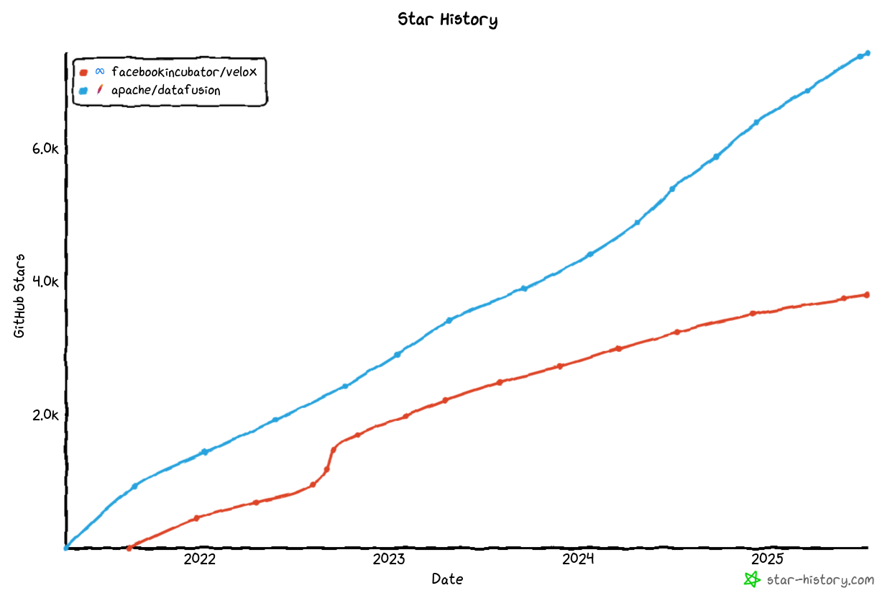
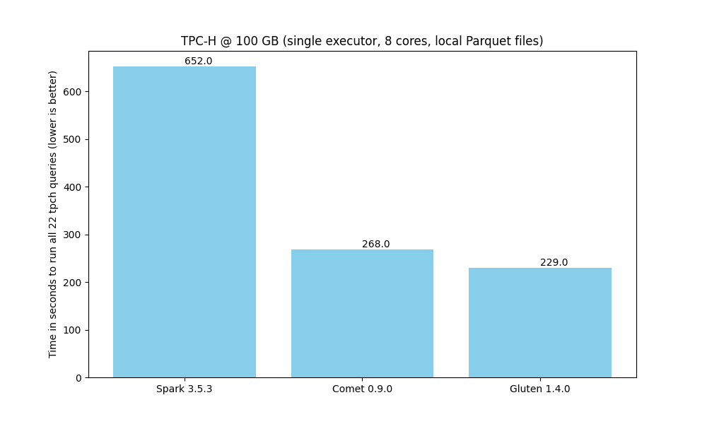

<!---
  Licensed to the Apache Software Foundation (ASF) under one
  or more contributor license agreements.  See the NOTICE file
  distributed with this work for additional information
  regarding copyright ownership.  The ASF licenses this file
  to you under the Apache License, Version 2.0 (the
  "License"); you may not use this file except in compliance
  with the License.  You may obtain a copy of the License at

    http://www.apache.org/licenses/LICENSE-2.0

  Unless required by applicable law or agreed to in writing,
  software distributed under the License is distributed on an
  "AS IS" BASIS, WITHOUT WARRANTIES OR CONDITIONS OF ANY
  KIND, either express or implied.  See the License for the
  specific language governing permissions and limitations
  under the License.
-->

# Comparison of Comet and Gluten

This document provides a comparison of the Comet and Gluten projects to help guide users who are looking to choose
between them. This document is likely biased because it is maintained by the Comet community.

We recommend trying out both Comet and Gluten to see which is the best fit for your needs.

This document is based on Comet 0.9.0 and Gluten 1.4.0.

## Architecture

Comet and Gluten have very similar architectures. Both are Spark plugins that translate Spark physical plans to
a serialized representation and pass them to native code for execution.

Gluten serializes the plans using the Substrait format and has an extensible architecture that supports execution
against multiple engines. Velox and Clickhouse are currently supported, but Velox is more widely used.

Comet serializes the plans in a proprietary Protocol Buffer format. Execution is delegated to Apache DataFusion. Comet
does not plan to support multiple engines, but rather focus on a tight integration between Spark and DataFusion.

## Underlying Execution Engine: DataFusion vs Velox

One of the main differences between Comet and Gluten is the choice of native execution engine.

Gluten uses Velox, which is an open-source C++ vectorized query engine created by Meta.

Comet uses Apache DataFusion, which is an open-source vectorized query engine implemented in Rust and is governed by the
Apache Software Foundation.

Velox and DataFusion are both mature query engines that are growing in popularity.

Comet may be a better choice for users with plans for integrating with other Rust software in the future, and
Gluten+Velox may be a better choice for users with plans for integrating with other C++ code.



## Compatibility

Comet relies on the full Spark SQL test suite (consisting of more than 24,000 tests) as well its own unit and
integration tests to ensure compatibility with Spark. Features that are known to have compatibility differences with
Spark are disabled by default, but users can opt in. See the [Comet Compatibility Guide] for more information.

[Comet Compatibility Guide]: compatibility.md

Gluten also aims to provide compatibility with Spark, and includes a subset of the Spark SQL tests in its own test
suite. See the [Gluten Compatibility Guide] for more information.

[Gluten Compatibility Guide]: https://apache.github.io/incubator-gluten-site/archives/v1.3.0/velox-backend/limitations/

## Performance

When running a benchmark derived from TPC-H on a single node against local Parquet files, we see that both Comet
and Gluten provide a good speedup when compared to Spark. Comet provides a 2.4x speedup compares to a 2.8x speedup 
with Gluten.

Gluten is currently slightly faster than Comet, but we expect to close that gap over time.



The scripts that were used to generate these results can be found [here](https://github.com/apache/datafusion-comet/tree/main/dev/benchmarks).

## Ease of Development

Comet has a much smaller codebase than Gluten. A fresh clone of the respective repositories shows that Comet has ~41k
lines of Scala+Java code and ~40k lines of Rust code. Gluten has ~207k lines of Scala+Java code and ~89k lines of C++
code.

Setting up a local development environment with Comet is generally easier than with Gluten due to Rust's package
management capabilities vs the complexities around installing C++ dependencies.

### Comet Lines of Code

```
-------------------------------------------------------------------------------
Language                     files          blank        comment           code
-------------------------------------------------------------------------------
Rust                           159           4870           5388          39989
Scala                          171           4849           6277          32538
Java                            66           1556           2619           8724
```

### Gluten Lines of Code

```
--------------------------------------------------------------------------------
Language                      files          blank        comment           code
--------------------------------------------------------------------------------
Scala                          1312          23264          37534         179664
C++                             421           9841          10245          64554
Java                            328           5063           6726          26520
C/C++ Header                    304           4875           6255          23527
```

## Summary

Comet and Gluten are both good solutions for accelerating Spark jobs. We recommend trying both to see which is the
best fit for your needs.
