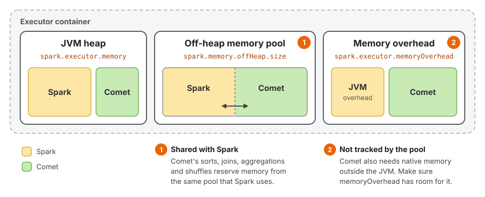

<!---
Licensed to the Apache Software Foundation (ASF) under one
or more contributor license agreements.  See the NOTICE file
distributed with this work for additional information
regarding copyright ownership.  The ASF licenses this file
to you under the Apache License, Version 2.0 (the
"License"); you may not use this file except in compliance
with the License.  You may obtain a copy of the License at

http://www.apache.org/licenses/LICENSE-2.0

Unless required by applicable law or agreed to in writing,
software distributed under the License is distributed on an
"AS IS" BASIS, WITHOUT WARRANTIES OR CONDITIONS OF ANY
KIND, either express or implied.  See the License for the
specific language governing permissions and limitations
under the License.
-->

# Memory Tuning

It is necessary to specify how much memory Comet can use in addition to memory already allocated to Spark. In some
cases, it may be possible to reduce the amount of memory allocated to Spark so that overall memory allocation is
the same or lower than the original configuration. In other cases, enabling Comet may require allocating more memory
than before. See the [Determining How Much Memory to Allocate] section for more details.

Comet needs two things configured: an off-heap pool for it to draw its reservations from, and enough executor memory
overhead to cover the part of its footprint that no pool tracks. See [Configuring Comet Memory] and
[Configuring Executor Memory Overhead].



[Determining How Much Memory to Allocate]: #determining-how-much-memory-to-allocate
[Configuring Comet Memory]: #configuring-comet-memory
[Configuring Executor Memory Overhead]: #configuring-executor-memory-overhead

## Configuring Comet Memory

Comet shares an off-heap memory pool with Spark. The size of the pool is
specified by `spark.memory.offHeap.size`. The pool is a shared _budget_ rather than a shared
allocator: Comet's native operators allocate from the Rust heap rather than from JVM off-heap
memory, but every reservation they make is charged against this same pool, so Comet and Spark's own
off-heap consumers draw down one number.

Comet's memory pool only tracks memory that an operator explicitly reserves, which in practice means the batches
an operator deliberately accumulates: the sort buffer, the build side of a hash join, hash aggregation state, and the
shuffle writer's buffered partitions. Memory that is not reserved is invisible to the pool no matter how much of it
there is. That includes:

- per-batch working memory in expression kernels and Arrow array builders,
- decompression buffers and Parquet reader structures,
- object store request buffers and the async runtime's own machinery,
- Arrow buffers allocated on the JVM side, which no budget covers at all,
- allocator overhead: buffer padding, size-class rounding, fragmentation, and pages the allocator retains after a
  free rather than returning to the operating system.

Reserved memory is therefore a lower bound on what Comet really uses, and how far below it sits depends on the
workload. This is why Comet can stay within the pool's limit and still push the executor past its container limit.
The part that is not counted has to fit in `spark.executor.memoryOverhead`, and each executor logs how large it is
while Comet runs; see [Sizing the Overhead from the Memory Usage Log].

`spark.comet.exec.memoryPool.fraction` is deprecated and does not leave room for it. Spark hands out all of
`spark.memory.offHeap.size` to the tasks that ask for it, whatever the fraction. The `fair_unified` pool applies the
fraction to each task separately, where Spark's own limit of an even share of the pool per running task is tighter
whenever more than one task is running, and the `greedy_unified` pool ignores it.

For more details about Spark off-heap memory mode, please refer to [Spark documentation].

[Spark documentation]: https://spark.apache.org/docs/latest/configuration.html

Comet implements multiple memory pool implementations. The type of pool can be specified with `spark.comet.exec.memoryPool`.

The valid pool types are:

- `fair_unified` (default when `spark.memory.offHeap.enabled=true` is set)
- `greedy_unified`

Both pool types are shared by all the native plans in the same Spark task. A task can run more than
one native plan at a time, for example the native operators on either side of a union or a
coalesce. The shared pool ensures that their combined memory usage stays within the per-task limit.

The `fair_unified` pool prevents operators from using more than an even fraction of the available memory
(i.e. `pool_size / num_consumers`, where `num_consumers` counts the memory consumers registered by all of the task's
native plans). This pool works best when you know beforehand
the query has multiple operators that will likely all need to spill. Sometimes it will cause spills even
when there is sufficient memory in order to leave enough memory for other operators.

Comet 0.15.0 through 1.0.0 capped the memory of all of a task's operators combined at one operator's share, because of a
bug ([#5961](https://github.com/apache/datafusion-comet/issues/5961)). Tasks with several operators can now reserve more
memory before they spill than they could in those releases. The difference is largest on executors that run few tasks
at once, where Spark's own limit on each task is loosest. If you sized executor memory against one of those releases,
check that executors still have enough headroom; see [Sizing the Overhead from the Memory Usage Log].

The `greedy_unified` pool type implements a greedy first-come first-serve limit. This pool works well for queries that do not
need to spill or have a single spillable operator.

## Configuring Executor Memory Overhead

Enabling off-heap memory is not sufficient on its own. Comet also needs room in
`spark.executor.memoryOverhead`.

`spark.memory.offHeap.size` is a budget, and the cluster manager already sizes the executor
container to include it, so the memory that Comet's operators explicitly reserve has room. What does
not have room is everything Comet allocates without reserving it — the untracked categories listed
under [Configuring Comet Memory]. Those allocations are made by the Rust global allocator and live
in the native heap, outside the JVM heap and outside Spark's off-heap allocations, and nothing in
the container sizing accounts for them. The same applies to Comet's JVM-side Arrow buffers.

`spark.executor.memoryOverhead` is the only slack the container has for this, and the JVM's own
non-heap usage — metaspace, code cache, thread stacks, GC structures — is already drawing on it.

Work out what the executor already gets before choosing a value. When
`spark.executor.memoryOverhead` is unset, Spark derives the overhead as
`max(spark.executor.memoryOverheadFactor * spark.executor.memory, 384 MiB)`. The factor defaults to
`0.1`, except for PySpark and SparkR applications submitted to Kubernetes in cluster mode, where it
defaults to `0.4`. On Spark 4.0 and later the floor is configurable through
`spark.executor.minMemoryOverhead`. Setting `spark.executor.memoryOverhead` **replaces** the derived
value rather than adding to it, so a value below what is derived today shrinks the container instead
of growing it.

For a small executor, `2g` is a reasonable starting point. A 4 GiB executor derives only 409 MiB, so
this is a real increase:

```
spark.executor.memoryOverhead=2g
```

A 32 GiB executor, on the other hand, already derives 3276 MiB, and the same setting would take away
1228 MiB. For executors that large, either pick an absolute value above what is derived today, or
raise `spark.executor.memoryOverheadFactor` instead so that the overhead keeps scaling with executor
size:

```
spark.executor.memoryOverheadFactor=0.2
```

Raise the value further if executors are killed by the cluster manager (on Kubernetes,
`ExecutorLostFailure` with exit code 137) rather than failing with a task-level out-of-memory error.
To measure how much Comet needs rather than guessing, see [Sizing the Overhead from the Memory Usage Log].

Note that on Kubernetes and YARN the overhead is added to the container size, so raising it reduces
how many executors fit on a node.

[Sizing the Overhead from the Memory Usage Log]: #sizing-the-overhead-from-the-memory-usage-log

## Sizing the Overhead from the Memory Usage Log

While Comet native plans are running, each executor logs its native memory usage at INFO level,
one line every 10 seconds for the whole executor:

```
Comet native memory usage: allocated 5412.3 MiB, reserved 3890.0 MiB (16 native plans, 8 memory pools)
```

- `allocated` is the memory that Comet's native code has allocated and not yet freed, whether or not
  a pool tracks it.
- `reserved` is the part that Comet's memory pools track. It is charged against
  `spark.memory.offHeap.size`, so the container already has room for it.

The difference between the two, `allocated - reserved`, is Comet's untracked native memory. It is
the part of Comet's footprint that has to fit in `spark.executor.memoryOverhead`, alongside the
JVM's own non-heap memory. To size the overhead from it:

1. Run a representative workload and find the line with the largest difference in each executor's
   log. Take both figures from the same line: they are sampled together, and figures from different
   lines describe different moments. Setting `spark.comet.memory.logInterval=1s` for this run makes a
   short-lived peak less likely to fall between samples.
2. Start from the overhead the executors had before Comet was enabled, which covers the JVM's own
   non-heap memory, and add the largest difference seen on any executor.
3. Add a margin on top. The log can miss the true peak between samples, and neither figure includes
   the allocator's fragmentation and retained pages, memory allocated by native C libraries such as
   zstd, or Comet's Arrow buffers on the JVM side.

For example, a 16 GiB executor derives an overhead of 1638 MiB. If the largest difference in its
log is the 1522.3 MiB in the line above, the overhead needs to be at least 1638 + 1523 = 3161 MiB
before any margin, so `spark.executor.memoryOverhead=4g` would be a reasonable setting.

The executor also logs a warning when its native memory looks larger than its container allows:
when the difference, plus everything in use in Spark's off-heap memory pool (which includes Comet's
reservations), exceeds `spark.memory.offHeap.size` plus the memory overhead. This counts the part of
the off-heap pool that nothing has acquired at that moment, which untracked memory can occupy until
Spark hands it out, so a quiet log is not a sign that the overhead is large enough: size it from the
largest difference as described above. The overhead also has to hold the JVM's own non-heap memory,
so by the time the warning appears the executor has likely outgrown its container. It warns the first time this
happens, and again each time it happens after dropping back below. The overhead it uses is
`spark.executor.memoryOverhead` if set, otherwise `spark.executor.memoryOverheadFactor` of
`spark.executor.memory` with a minimum of `spark.executor.minMemoryOverhead`, as Spark sizes the
default container. There is no warning in local mode.

Look more closely before raising the overhead if the difference keeps growing through a run rather
than levelling off: native memory that is not being released will exhaust any overhead eventually.
The executor logs one more line after its last native plan finishes, and an `allocated` figure there
that grows from one query to the next points the same way.

`spark.comet.memory.logInterval` is read when an executor starts its first Comet native plan, so set
it when the application is submitted. Set it to `0` to turn the log off.

## Determining How Much Memory to Allocate

Generally, increasing the amount of memory allocated to Comet will improve query performance by reducing the
amount of time spent spilling to disk, especially for aggregate, join, and shuffle operations. Allocating insufficient
memory can result in out-of-memory errors. This is no different from allocating memory in Spark and the amount of
memory will vary for different workloads, so some experimentation will be required.

Here is a real-world example, based on running benchmarks derived from TPC-H, running on a single executor against
local Parquet files using the 100 GB data set.

Baseline Spark Performance

- Spark completes the benchmark in 632 seconds with 8 cores and 8 GB RAM
- With less than 8 GB RAM, performance degrades due to spilling
- Spark can complete the benchmark with as little as 3 GB of RAM, but with worse performance (744 seconds)

Comet Performance

- Comet requires at least 5 GB of RAM, but performance at this level
  is around 340 seconds, which is significantly faster than Spark with any amount of RAM
- Comet running in off-heap with 8 cores completes the benchmark in 295 seconds, more than 2x faster than Spark
- It is worth noting that running Comet with only 4 cores and 4 GB RAM completes the benchmark in 520 seconds,
  providing better performance than Spark for half the resource

It may be possible to reduce Comet's memory overhead by reducing batch sizes or increasing number of partitions.

## Batch Size

Comet processes data in columnar batches. The batch size is controlled by `spark.comet.batchSize` (default
`8192` rows). Larger batches generally improve throughput by amortizing per-batch overhead, but they also
increase peak memory usage — a batch holds all projected columns in Arrow format at once. Reduce this value
if you see frequent spilling or out-of-memory errors on wide tables; increase it (for example to `16384`) on
narrow tables when memory is plentiful.

`spark.comet.shuffle.jvm.batchSize` controls the batch size used when the JVM columnar shuffle writer
flushes sorted spill files. It must not exceed `spark.comet.batchSize`.

## Limiting Spill Disk Usage

Native operators that spill to disk (aggregate, sort, shuffle) are bounded by
`spark.comet.maxTempDirectorySize` (default 100 GB). The operators of one Comet native plan share
the limit. A Spark task can run more than one native plan at a time, for example the native
operators on either side of a union or a coalesce, so an executor running `N` concurrent tasks may
use more than `N` times this value on shared local disks. If the limit is reached, further spills
fail and the query errors out. Raise this on workloads with large sort/aggregate/shuffle spills, or
lower it to protect executors on shared disks, remembering that the total across an executor is a
multiple of this value.
